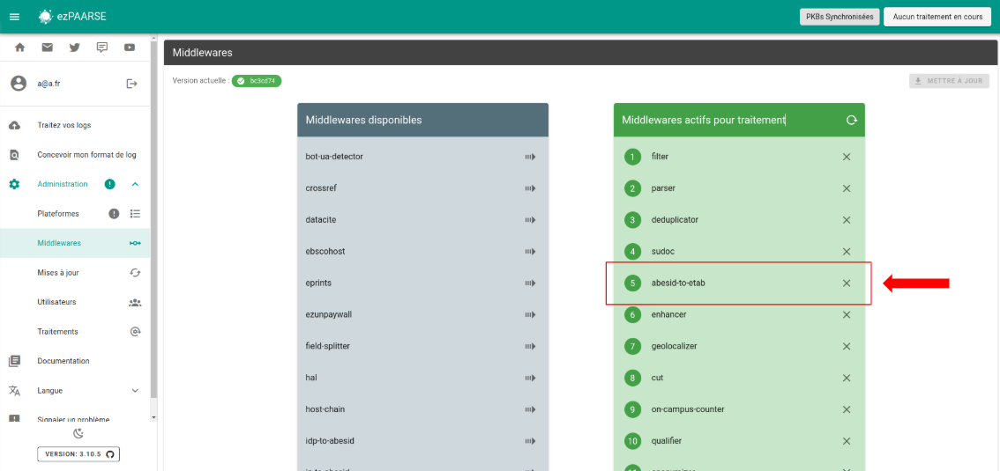
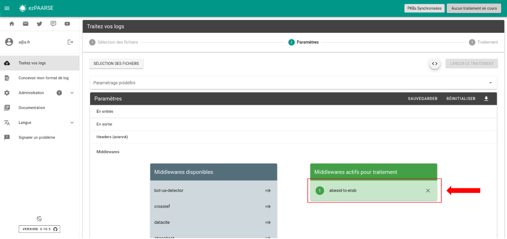

# abesid-to-etab

Add information about institution with abesID

## Enriched fields

| Name | Type | Description |
| --- | --- | --- |
| institutionName | String | Name of institution. |

## Prerequisites

abesid-to-etab enrichment middleware needs abes-id.

You need to add Etablissements.csv here

**You must use abesid-to-etab after filter, parser, deduplicator middleware.**

## Headers

+ **abesid-to-etab-source-field** : Fields in the ec for enrichment. "abes-id" by default.
+ **abesid-to-etab-enriched-field** : Enriched field in the EC. "institutionName" by default.
```
By default.

### Example

## How to use

### ezPAARSE admin interface

You can add abesid-to-etab by default to all your enrichments, To do this, go to the middleware section of administration.



### ezPAARSE process interface

You can use abesid-to-etab for an enrichment process. You just add the middleware.



### ezp

You can use abesid-to-etab for an enrichment process with [ezp](https://github.com/ezpaarse-project/node-ezpaarse) like this:

```bash
# enrich with one file
ezp process <path of your file> \
  --host <host of your ezPAARSE instance> \
  --settings <settings-id> \
  --header "ezPAARSE-Middlewares: abesid-to-etab" \
  --out ./result.csv

# enrich with multiples files
ezp bulk <path of your directory> \
  --host <host of your ezPAARSE instance> \
  --settings <settings-id> \
  --header "ezPAARSE-Middlewares: abesid-to-etab" 

```

### curl

You can use abesid-to-etab for an enrichment process with curl like this:

```bash
curl -X POST -v http://localhost:59599 \
  -H "ezPAARSE-Middlewares: abesid-to-etab" \
  -H "Log-Format-Ezproxy: <line format>" \
  -F "file=@<log file path>"

```