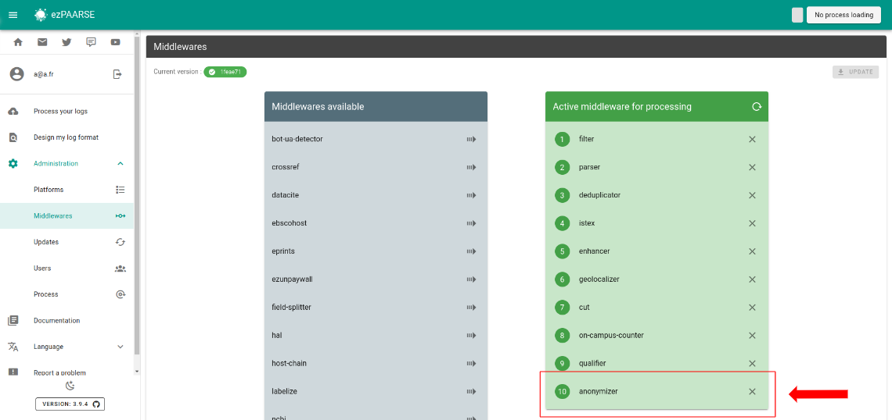
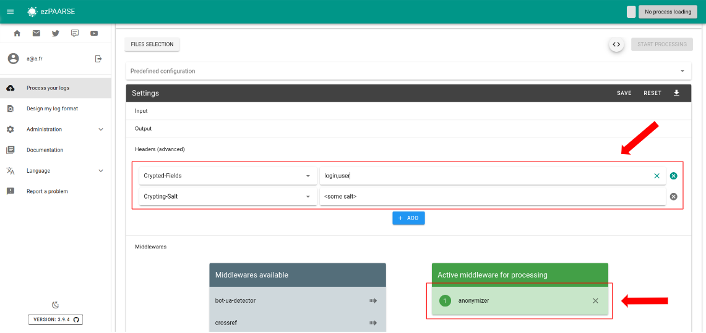

# anonymizer

Anonymizes a list of fields.

**This middleware is activated by default.**

## Prerequisites

Your EC needs a print_identifier for enrichment. 

**You must use anonymizer after filter, parser, deduplicator middleware.**

**It is recommended to use it after all middleware. Depending on its settings and if it is placed at the beginning, it may cancel some enrichment.**

## Headers

+ **Crypted-Fields** : name of the fields to be encrypted *(default: host,login)*
+ **Crypting-Algorithm** : Encryption algorithm *(default: sha1)*
+ **Crypting-Salt** : Encryption salt

## How to use

### ezPAARSE admin interface

You can add anonymizer by default to all your enrichments, To do this, go to the middleware section of administration.



### ezPAARSE process interface

You can use anonymizer for an enrichment process. You just add the middleware.



### ezp

You can use anonymizer for an enrichment process with [ezp](https://github.com/ezpaarse-project/node-ezpaarse) like this:

```bash
# enrich with one file
ezp process <path of your file> \
  --host <host of your ezPAARSE instance> \
  --settings <settings-id> \
  --header "ezPAARSE-Middlewares: anonymizer" \
  --header "Crypted-Fields: login, user" \
  --header "Crypted-Salt: <some salt>" \
  --out ./result.csv

# enrich with multiples files
ezp bulk <path of your directory> \
  --host <host of your ezPAARSE instance> \
  --settings <settings-id> \
  --header "ezPAARSE-Middlewares: anonymizer" \
  --header "Crypted-Fields: login, user" \
  --header "Crypted-Salt: <some salt>" 

```

### curl

You can use anonymizer for an enrichment process with curl like this:

```bash
curl -X POST -v http://localhost:59599 \
  -H "ezPAARSE-Middlewares: anonymizer" \
  -H "Crypted-Fields: login, user" \
  -H "Crypted-Salt: <some salt>" \
  -H "Log-Format-Ezproxy: <line format>" \
  -F "file=@<log file path>"

```