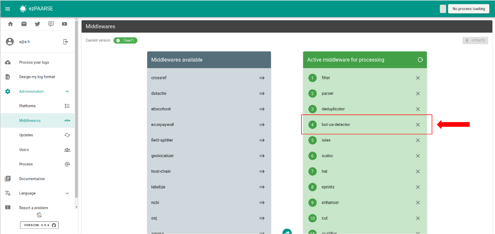
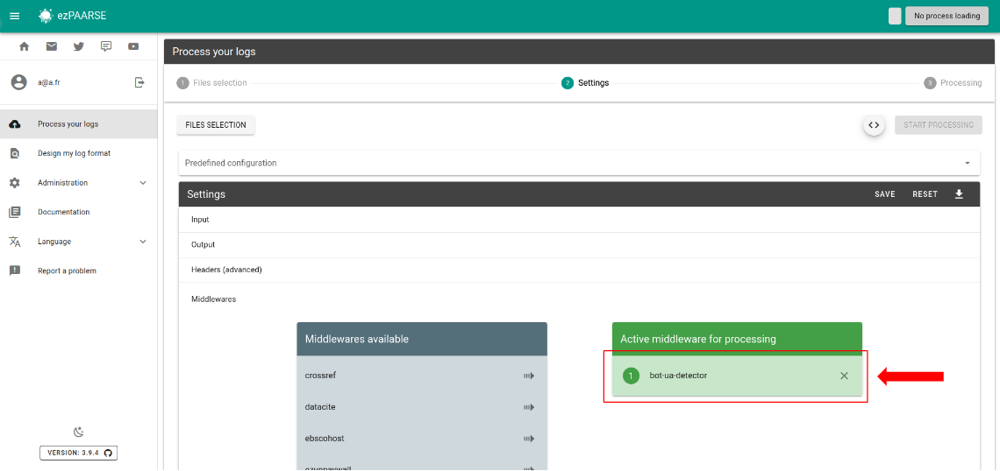

# bot-ua-detector

Mark ECs as robots if their user-agent string match a regex in the COUNTER [robot list](https://raw.githubusercontent.com/atmire/COUNTER-Robots/master/generated/COUNTER_Robots_list.txt).

## Enriched fields

| Name | Type | Description |
| --- | --- | --- |
| robot | boolean | Is robot or not. |

## Prerequisites

**You must use bot-ua-detector after filter, parser, deduplicator middleware.**

## Headers

+ **robot-refresh-timeout** : Robot refresh time *(default: 5000ms)*

## How to use

### ezPAARSE admin interface

You can add or remove bot-ua-detector by default to all your enrichments. To do this, go to the middleware section of administration.



### ezPAARSE process interface

You can use bot-ua-detector for an enrichment process.



### ezp

You can use bot-ua-detector for an enrichment process with [ezp](https://github.com/ezpaarse-project/node-ezpaarse) like this:

```bash
# enrich with one file
ezp process <path of your file> \
  --host <host of your ezPAARSE instance> \
  --settings <settings-id> \
  --header "ezPAARSE-Middlewares: bot-ua-detector" \
  --out ./result.csv

# enrich with multiples files
ezp bulk <path of your directory> \
  --host <host of your ezPAARSE instance> \
  --settings <settings-id> \
  --header "ezPAARSE-Middlewares: bot-ua-detector" 

```

### curl

You can use bot-ua-detector for an enrichment process with curl like this:

```bash
curl -X POST -v http://localhost:59599 \
  -H "ezPAARSE-Middlewares: bot-ua-detector" \
  -H "Log-Format-Ezproxy: <line format>" \
  -F "file=@<log file path>"

```