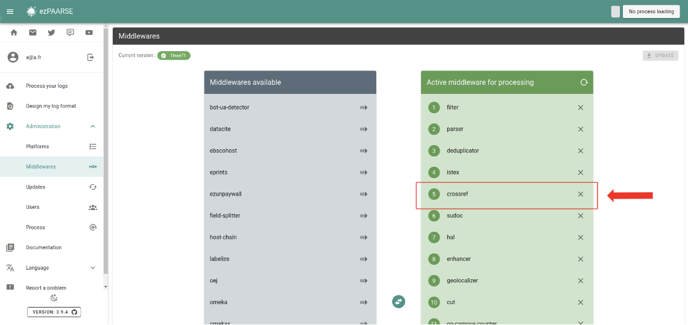
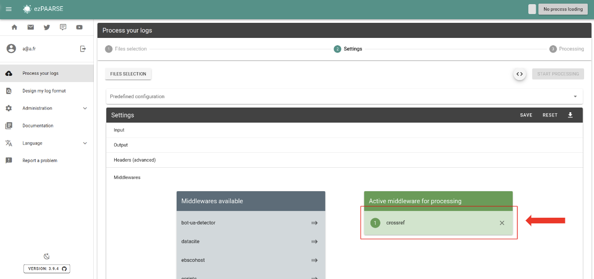

# crossref

Fetches [crossref](http://search.crossref.org/) data from their [API](http://search.crossref.org/help/api).

**This middleware is activated by default.**

## Enriched fields

| Name | Type | Description |
| --- | --- | --- |
| publication_title | String | Name of publication. |
| title | String | Title of publication. |
| type | String | type of document (journal-article, book-chapter, conference-paper, dissertation, report, dataset etc.) | 
| rtype | String | Variation of type |
| publication_date | String | Date of resource. |
| publisher_name | String | Name of publisher. |
| print_identifier | Number | ISBN or ISSN. | 
| online_identifier | Number | EISBN or EISSN. | 
| subject | String | subject, thematic of publication | 
| doi | String | DOI of publication. | 
| license | String | Licence. | 

## Prerequisites

Your EC needs a DOI or alternative ID (any other identifier a publisher may have provided) for enrichment.

**You must use crossref after filter, parser, deduplicator middleware.**

## Headers

+ **crossref-enrich** : Set to ``false`` to disable crossref enrichment. Enabled by default.
+ **crossref-cache** : Enable/Disable cache.
+ **crossref-license** : Set to ``true`` to get the ``license`` field as JSON. Disabled by default.
+ **crossref-ttl** : Lifetime of cached documents, in seconds. Defaults to ``7 days (3600 * 24 * 7)``.
+ **crossref-throttle** : Minimum time to wait between queries, in milliseconds. Defaults to ``200``ms.
+ **crossref-paquet-size** : Maximum number of identifiers to send for query in a single request. Defaults to ``50``.
+ **crossref-buffer-size** : Maximum number of memorised access events before sending a request. Defaults to ``1000``.
+ **crossref-max-tries** : Maximum number of attempts if an enrichment fails. Defaults to ``5``.
+ **crossref-on-fail** : Strategy to adopt if an enrichment reaches the maximum number of attempts. Can be either of ``abort``, ``ignore`` or ``retry``. Defaults to ``abort``.
+ **crossref-base-wait-time** : Time to wait before retrying after a query fails, in milliseconds. Defaults to ``1000``ms. This time ``doubles`` after each attempt.
+ **crossref-plus-api-token** : If you signed up for the ``Plus`` service, put your token in this header.
+ **crossref-user-agent** : Specify what to send in the `User-Agent` header when querying Crossref. Defaults to `ezPAARSE (https://readmetrics.org; mailto:ezteam@couperin.org)`.

## How to use

### ezPAARSE admin interface

You can add crossref by default to all your enrichments, To do this, go to the middleware section of administration.



### ezPAARSE process interface

You can use crossref for an enrichment process. You just add the middleware.



### ezp

You can use crossref for an enrichment process with [ezp](https://github.com/ezpaarse-project/node-ezpaarse) like this:

```bash
# enrich with one file
ezp process <path of your file> \
  --host <host of your ezPAARSE instance> \
  --settings <settings-id> \
  --header "ezPAARSE-Middlewares: crossref" \
  --out ./result.csv

# enrich with multiples files
ezp bulk <path of your directory> \
  --host <host of your ezPAARSE instance> \
  --settings <settings-id> \
  --header "ezPAARSE-Middlewares: crossref" 

```

### curl

You can use crossref for an enrichment process with curl like this:

```bash
curl -X POST -v http://localhost:59599 \
  -H "ezPAARSE-Middlewares: crossref" \
  -H "Log-Format-Ezproxy: <line format>" \
  -F "file=@<log file path>"

```