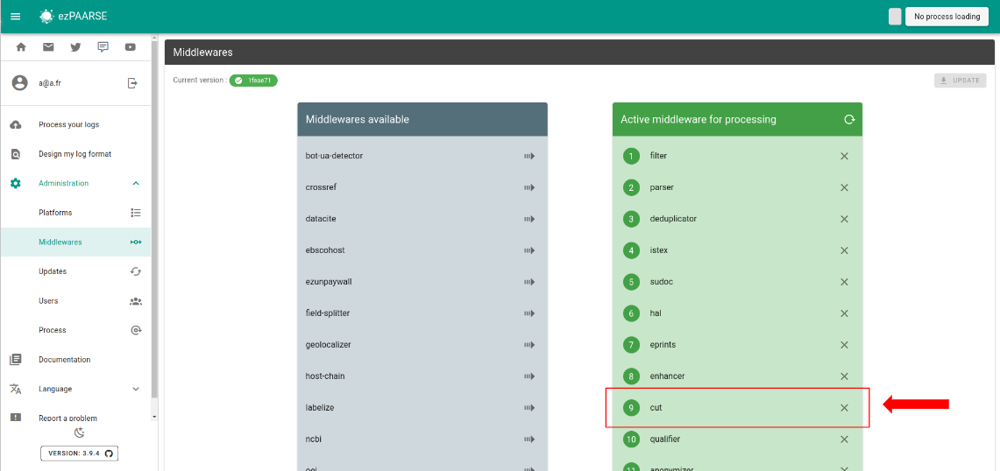
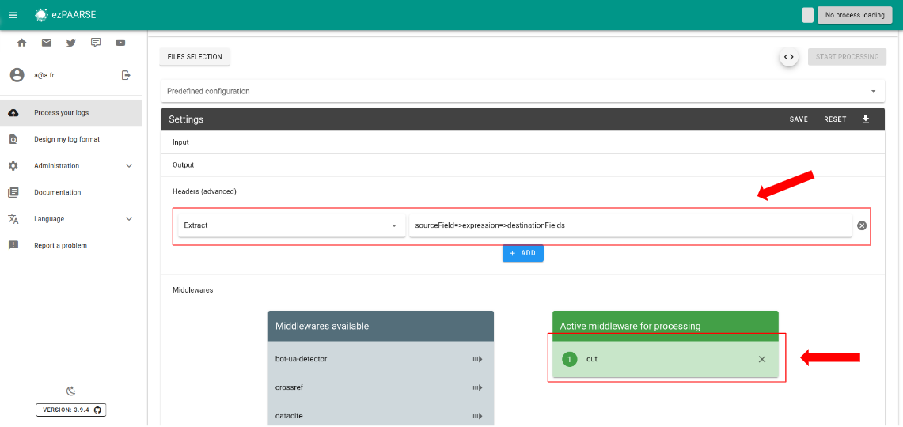

# cut

Separates any unique field into two or more distinct fields, based on a given separator or regular expression.

**This middleware is activated by default.**
No config is set by default.

## Enriched fields

| Name | Type | Description |
| --- | --- | --- |
| destinationFields | String | custom fields | 

## Prerequisites

Your EC needs sourceField that exist.

**You must use cut after filter, parser, deduplicator middleware.**

## Headers

+ **extract** : This header takes 3 parameters which are ``sourceField``, ``expression`` and ``destinationFields``, e.g: ``sourceField=>expression=>destinationFields``

## How to use

### ezPAARSE admin interface

You can add or remove cut by default to all your enrichments. To do this, go to the middleware section of administration.



### ezPAARSE process interface

You can use cut for an enrichment process.



### ezp

You can use cut for an enrichment process with [ezp](https://github.com/ezpaarse-project/node-ezpaarse) like this:

```bash

# Use with split function

# enrich with one file
ezp process <path of your file> \
  --host <host of your ezPAARSE instance> \
  --settings <settings-id> \
  --header "ezPAARSE-Middlewares: cut" \
  --header "extract: email => split(@) => identifiant,domainName" \
  --out ./result.csv

# enrich with multiples files
ezp bulk <path of your directory> \
  --host <host of your ezPAARSE instance> \
  --settings <settings-id> \
  --header "ezPAARSE-Middlewares: cut" \
  --header "extract: email => split(@) => identifiant,domainName"

# Use with regex

# enrich with one file
ezp process <path of your file> \
  --host <host of your ezPAARSE instance> \
  --settings <settings-id> \
  --header "ezPAARSE-Middlewares: cut" \
  --header "extract: login => /^([a-z]+)\.([a-z]+)$/ => lastName,firstName" \
  --out ./result.csv

# enrich with multiples files
ezp bulk <path of your directory> \
  --host <host of your ezPAARSE instance> \
  --settings <settings-id> \
  --header "ezPAARSE-Middlewares: cut" \
  --header "extract: login => /^([a-z]+)\.([a-z]+)$/ => lastName,firstName"

```

### curl

You can use cut for an enrichment process with curl like this:

```bash

# Use with split function
curl -X POST -v http://localhost:59599 \
  -H "ezPAARSE-Middlewares: cut" \
  -H "extract: email => split(@) => identifiant,domainName" \
  -H "Log-Format-Ezproxy: <line format>" \
  -F "file=@<log file path>"

# Use with regex
curl -X POST -v http://localhost:59599 \
  -H "ezPAARSE-Middlewares: cut" \
  -H "extract: login => /^([a-z]+)\.([a-z]+)$/ => lastName,firstName" \
  -H "Log-Format-Ezproxy: <line format>" \
  -F "file=@<log file path>"

```