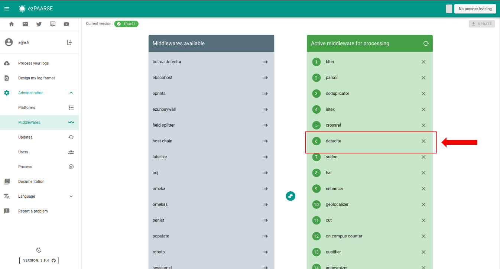
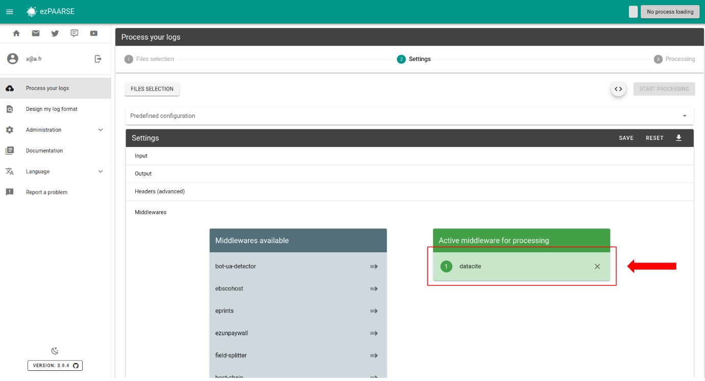

# datacite

Middleware that fetches metadata from the API [datacite](https://datacite.org/)

## Enriched fields

| Name | Type | Description |
| --- | --- | --- |
| publication_title | String | Name of publication. |
| publication_date | String | Date of publication. |
| publisher_name | String | Name of publisher. |

## Prerequisites

Your EC needs a DOI for enrichment.

**You must use datacite after filter, parser, deduplicator middleware.**

## Headers

+ **datacite-cache** : Enable/Disable cache.
+ **datacite-ttl** : Lifetime of cached documents, in seconds. Defaults to ``7 days (3600 * 24 * 7)``.
+ **datacite-throttle** : Minimum time to wait between queries, in milliseconds. Defaults to ``100``ms.
+ **datacite-paquet-size** : Maximum number of identifiers to send for query in a single request. Defaults to ``50``.
+ **datacite-buffer-size** : Maximum number of memorised access events before sending a request. Defaults to ``1000``.

## How to use

### ezPAARSE admin interface

You can add or remove datacite by default to all your enrichments, To do this, go to the middleware section of administration.



### ezPAARSE process interface

You can use datacite for an enrichment process. You just add the middleware.




### ezp

```bash
# enrich with one file

ezp process <path of your file> \
  --host <host of your ezPAARSE instance> \
  --settings <settings-id> \
  --header "ezPAARSE-Middlewares: datacite" \
  --out ./result.csv

# enrich with multiples files

ezp bulk <path of your directory> \
  --host <host of your ezPAARSE instance> \
  --settings <settings-id> \
  --header "ezPAARSE-Middlewares: datacite" \

```

### curl

```bash
curl -X POST -v http://localhost:59599 \
  -H "ezPAARSE-Middlewares: datacite" \
  -H "Log-Format-Ezproxy: <line format>" \
  -F "file=@/<log file path>"

```
