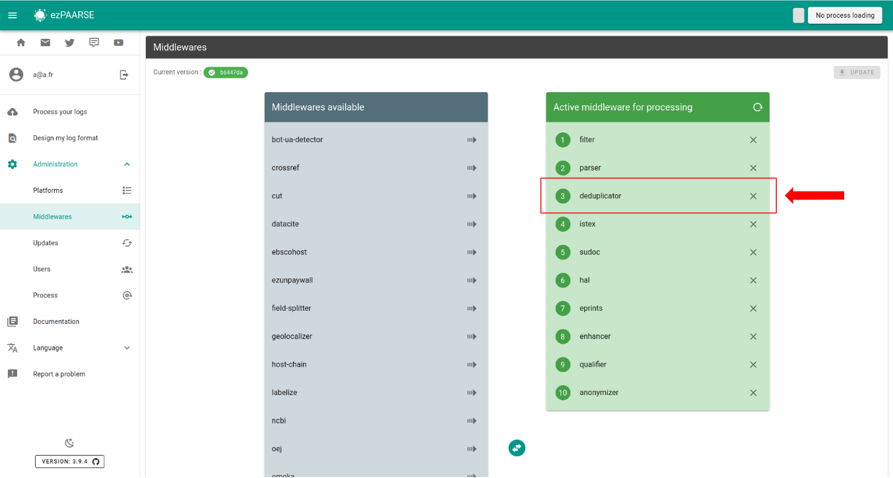

# deduplicator

Removes duplicate consultation events, based on the COUNTER algorithm for double-clicks.

[See this](https://ezpaarse-project.github.io/ezpaarse/features/doubleclick.html) for more details.

**This middleware is activated by default.**

## Prerequisites

**You must use deduplicator after filter middleware.**

## Headers

+ **Double-Click-Removal**: COUNTER deduplication activated (true by default). If this header is used, it means the deduplication is not activated (with the false value) and the other Double-Click- headers are useless.
+ **Double-Click-HTML**: sets the minimum delay (in seconds) between two requests considered identical to an HTML resource (10 by default).
+ **Double-Click-PDF**: sets the minimum delay (in seconds) between two requests considered identical to a PDF resource (30 by default).
+ **Double-Click-MISC**: sets the minimum delay (in seconds) between two requests considered identical to a MISC resource (neither HTML, nor PDF) (20 by default).
+ **Double-Click-MIXED**: sets the minimum delay (in seconds) between two requests considered identical to a resource, whatever its format (ie. the access to a same resource in HTML then in PDF can be considered as a double-click). The delays set for each format are then ignored.
+ **Double-Click-Strategy**: the strategy (in the form of a sequence of ordered letters) used to define the uniqueness of the user accessing a resource. The fields are searched sequentially. If one field is lacking, the following one is used. The letter C corresponds to the field containing the cookie (or session ID). The letter L corresponds to the login of the user. The letter I corresponds to the IP address contained in the host field. (CLI by default)
  + **Double-Click-C-field**: field name that will be looked for in the logs. This field coming from the custom log format parameters will be used to trace the cookie identifying the user (or its session ID). By default, it is not possible for ezPAARSE to know the field if it's not specified in the custom log format parameter. (ignored by default)
  + **Double-Click-L-field**: field name that will be looked for in the logs to identify the user login (corresponds to %u in the log format syntax). (%u by default).
  + **Double-Click-I-field**: field name that will be looked for in the logs to identify the user host (corresponds to %h in the log format syntax). (%h by default).

## How to use

### ezPAARSE admin interface

You can add or remove deduplicator by default to all your enrichments, To do this, go to the middleware section of administration.



### ezPAARSE process interface

You can use deduplicator for an enrichment process. You just add the middleware.


### ezp

```bash
# enrich with one file
ezp process <path of your file> \
  --host <host of your ezPAARSE instance> \
  --settings <settings-id> \
  --header "ezPAARSE-Middlewares: deduplicator" \
  --out ./result.csv

# enrich with multiples files
ezp bulk <path of your directory> \
  --host <host of your ezPAARSE instance> \
  --settings <settings-id> \
  --header "ezPAARSE-Middlewares: deduplicator" \

```

### curl

```bash
curl -X POST -v http://localhost:59599 \
  -H "ezPAARSE-Middlewares: deduplicator" \
  -H "Log-Format-Ezproxy: <line format>" \
  -F "file=@<log file path>"

```
