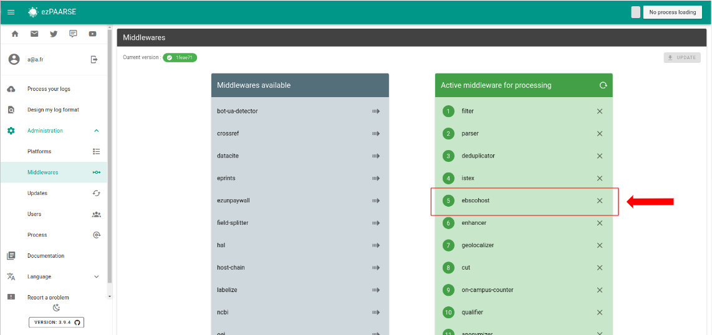
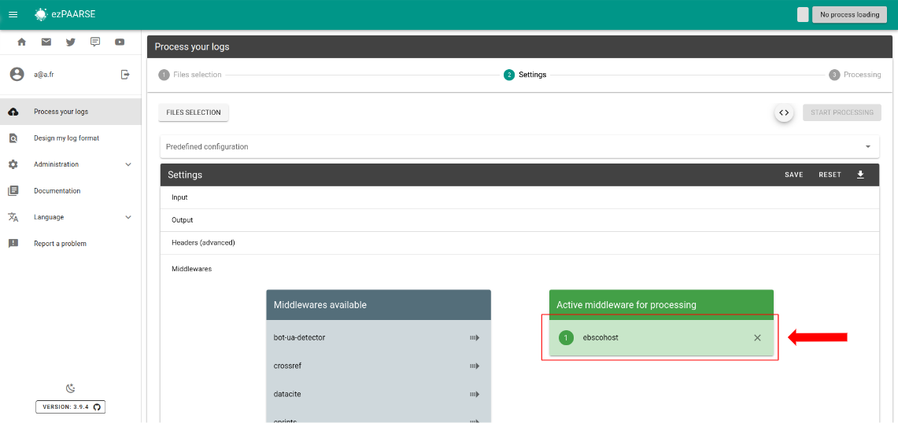

# ebscohost

Middleware that assign titles in the official [short names list](https://github.com/ezpaarse-project/ezpaarse-middlewares/blob/master/ebscohost/list.json)

## Enriched fields

| Name | Type | Description |
| --- | --- | --- |
| db_title  | String | Title of database. |

## Prerequisites

Your EC needs a print_identifier for enrichment. 

**You must use ebscohost after filter, parser, deduplicator middleware.**

## Headers

+ **ebscohost-enrich** : Set to ``false`` to disable ebscohost enrichment. Enabled by default.
+ **ebscohost-ttl** : Lifetime of cached documents, in seconds. Defaults to ``7 days (3600 * 24 * 7)``.
+ **ebscohost-throttle** : Minimum time to wait between queries, in milliseconds. Defaults to ``200``ms.

## How to use

### ezPAARSE admin interface

You can add ebscohost by default to all your enrichments, To do this, go to the middleware section of administration.



### ezPAARSE process interface

You can use ebscohost for an enrichment process. You just add the middleware.



### ezp

You can use ebscohost for an enrichment process with [ezp](https://github.com/ezpaarse-project/node-ezpaarse) like this.

```bash
# enrich with one file

ezp process <path of your file> \
  --host <host of your ezPAARSE instance> \
  --settings <settings-id> \
  --header "ezPAARSE-Middlewares: ebscohost" \
  --out ./result.csv

# enrich with multiples files

ezp bulk <path of your directory> \
  --host <host of your ezPAARSE instance> \
  --settings <settings-id> \
  --header "ezPAARSE-Middlewares: ebscohost" 

```

### curl

You can use ebscohost for an enrichment process with curl like this

```bash
curl -X POST -v http://localhost:59599 \
  -H "ezPAARSE-Middlewares: ebscohost" \
  -H "Log-Format-Ezproxy: <line format>" \
  -F "file=@/<log file path>"

```