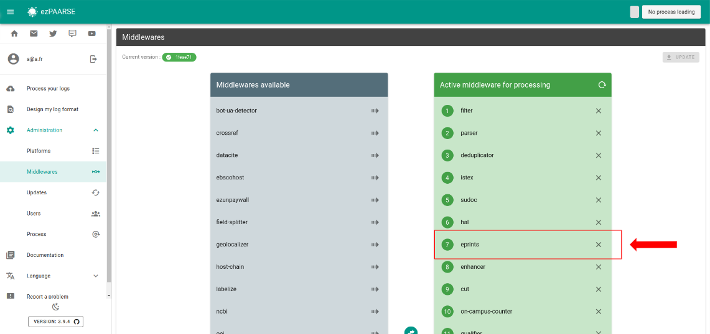
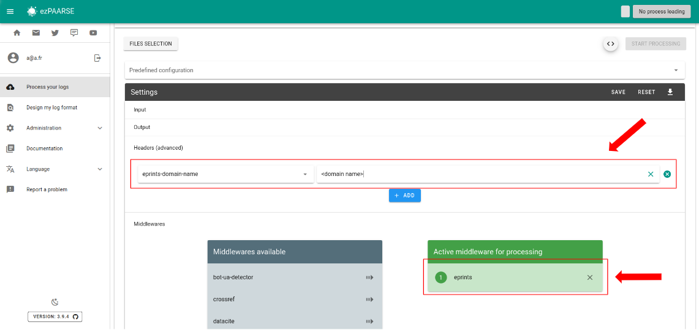

# eprints

Fetches data from eprints platforms.
This middleware was designed to measure only the logs of eprint platforms.

## Enriched fields

| Name | Type | Description |
| --- | --- | --- |
| publication_title | String | Name of publication. |
| publication_date | String | Date of resource. |
| doi | String | DOI of publication. |
| publisher_name | String | Name of publisher |
| language | String | language of resource |

## Prerequisites

This middleware can only be used to enrich one eprints platform per process. 
Your EC needs a domain belonging to an eprint platform and a eprints ID.

**You must use eprints after filter, parser, deduplicator middleware.**

## Headers

+ **eprints-cache** : Enabled/Disabled cache
+ **eprints-ttl** : Time-to-live of cached documents
+ **eprints-throttle** : Minimum wait time before each request (in ms)
+ **eprints-packet-size** : Maximum number of article to query
+ **eprints-buffer-size** : Minimum number of ECs to keep before resolving them
+ **eprints-domain-name** : Domain name eprints platform 

## How to use

### ezPAARSE admin interface

You can add eprints by default to all your enrichments, To do this, go to the middleware section of administration.



### ezPAARSE process interface

You can use eprints for an enrichment process. You just add the middleware.



### ezp

You can use eprints for an enrichment process with [ezp](https://github.com/ezpaarse-project/node-ezpaarse) like this:

```bash
# enrich with one file
ezp process <path of your file> \
  --host <host of your ezPAARSE instance> \
  --settings <settings-id> \
  --header "ezPAARSE-Middlewares: eprints" \
  --header "eprints-domain-name: <host of eprints platform>" \
  --out ./result.csv

# enrich with multiples files
ezp bulk <path of your directory> \
  --host <host of your ezPAARSE instance> \
  --settings <settings-id> \
  --header "ezPAARSE-Middlewares: eprints" \
  --header "eprints-domain-name: <host of eprints platform>"

```

### curl

You can use eprints for an enrichment process with curl like this:

```bash
curl -X POST -v http://localhost:59599 \
  -H "ezPAARSE-Middlewares: eprints" \
  -H "eprints-domain-name: <host of eprints platform>" \
  -H "Log-Format-Ezproxy: <line format>" \
  -F "file=@<log file path>"

```