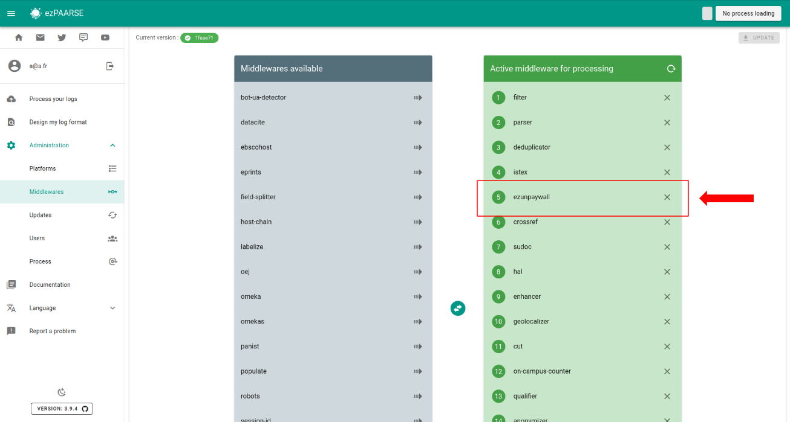
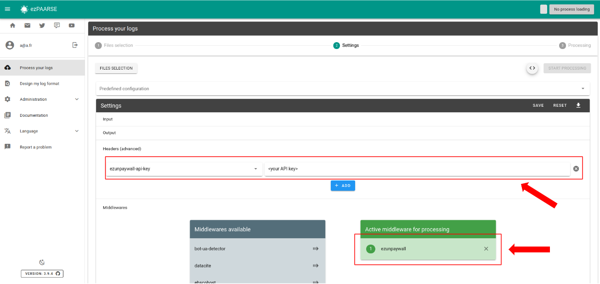

# ezunpaywall

Fetches [unpaywall](https://www.unpaywall.org/) metadata from [ezunpaywall](https://unpaywall.inist.fr/), the Unpaywall mirror hosted by the Inist-CNRS. this data are uses to enrich EC.

## Enriched fields

| Name | Type | Description |
| --- | --- | --- |
| publication_title | String | Name of publication. |
| is_oa | Boolean | Is there an OA copy of this resource. |
| journal_is_in_doaj | Boolean | Is this resource published in a DOAJ-indexed journal. |
| journal_is_oa | Boolean | Is this resource published in a completely OA journal. |
| oa_status | String | The OA status, or color, of this resource. |
| updated | String | Time when the data for this resource was last updated. |
| print_identifier | ISSN |
| online_identifier | ISBN |
| publication_date | Publication date |
| publisher | Name of publisher |
| oa_request_date | Date | Date of open access information. |

## Prerequisites

Your EC needs a DOI for enrichment.
You need an API key to use this service. You can use the **demo** apikey but it's limited to **100 000** DOIs per day for everyone.
**Open access information is valid for EC generated on the same day**. Unpaywall data does not retain open access history.

**You must use ezunpaywall after filter, parser, deduplicator middleware.**

## Headers

+ **ezunpaywall-cache** : Enable/Disable cache.
+ **ezunpaywall-ttl** : Lifetime of cached documents, in seconds. Defaults to ``7 days (3600 * 24 * 7)``.
+ **ezunpaywall-throttle** : Minimum time to wait between queries, in milliseconds. Defaults to ``100``ms.
+ **ezunpaywall-paquet-size** : Maximum number of identifiers to send for query in a single request. Defaults to ``100``.
+ **ezunpaywall-buffer-size** : Maximum number of memorized access events before sending a request. Defaults to ``1000``.
+ **ezunpaywall-max-attempts** : Maximum number of trials before passing the EC in error. Defaults to ``5``.
+ **ezunpaywall-api-key** : apikey to use ezunpaywall.

## How to use

### ezPAARSE config

You can add or remove your ezunpaywall on ezpaarse config. It will be used on every process that used ezunpaywall middleware. You need to add this code on your `config.local.json`.

```json
{
  "EZPAARSE_DEFAULT_HEADERS": {
    "ezunpaywall-api-key": "<ezunpaywall apikey>"
  }
}
```

### ezPAARSE admin interface

You can add or remove ezunpaywall by default to all your enrichments, provided you have added an API key in the config. To do this, go to the middleware section of administration.



### ezPAARSE process interface

You can use ezunpaywall for an enrichment process. You just add the middleware and enter the API key.



### ezp

You can use ezunpaywall for an enrichment process with [ezp](https://github.com/ezpaarse-project/node-ezpaarse) like this:

```bash
# enrich with one file
ezp process <path of your file> \
  --host <host of your ezPAARSE instance> \
  --settings <settings-id> \
  --header "ezPAARSE-Middlewares: ezunpaywall" \
  --header "ezunpaywall-api-key: <ezunpaywall apikey>" \
  --out ./result.csv

# enrich with multiples files
ezp bulk <path of your directory> \
  --host <host of your ezPAARSE instance> \
  --settings <settings-id> \
  --header "ezPAARSE-Middlewares: ezunpaywall" \
  --header "ezunpaywall-api-key: <ezunpaywall apikey>"

```

### curl

You can use ezunpaywall for an enrichment process with curl like this:

```bash
curl -X POST -v http://localhost:59599 \
  -H "ezPAARSE-Middlewares: ezunpaywall" \
  -H "ezunpaywall-api-key: <ezunpaywall apikey>" \
  -H "Log-Format-Ezproxy: <line format>" \
  -F "file=@<log file path>"

```
