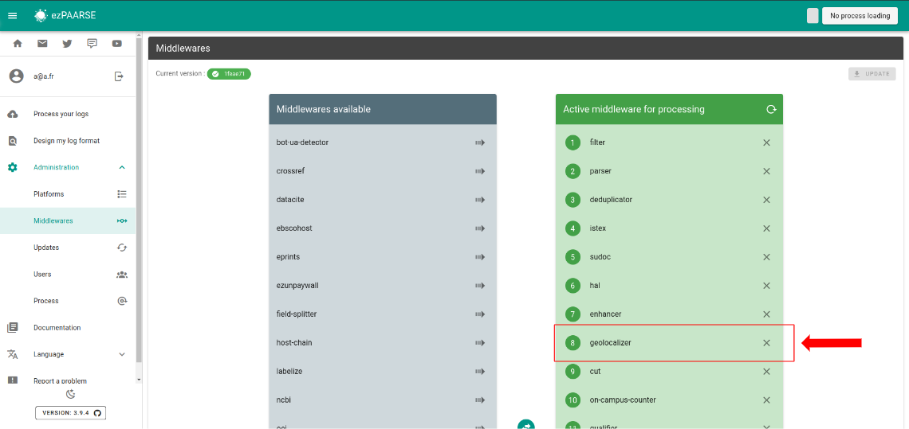
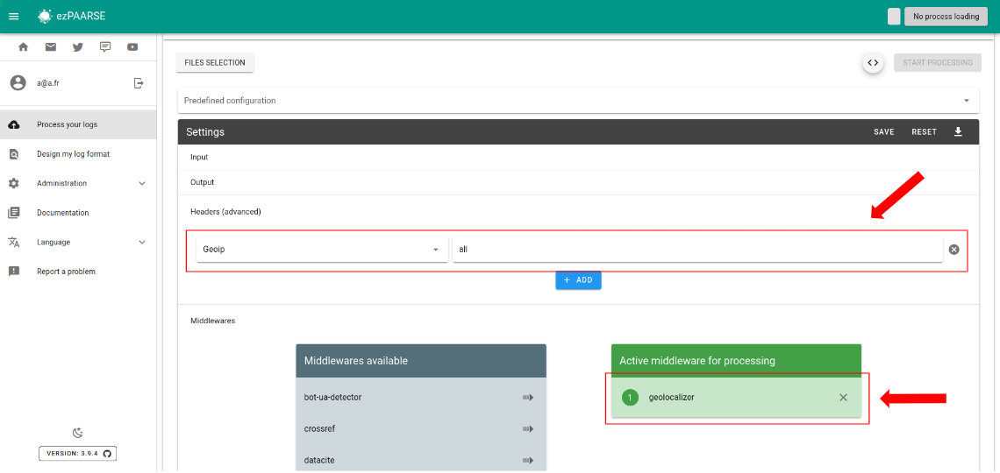

# geocalizer

Middleware that geolocalize consultation events based on an IP address.

**This middleware is activated by default.**

## Enriched fields

| Name | Type | Description |
| --- | --- | --- |
| geoip-host | String | IP address being geolocalized |
| geoip-country | String | `` 2 characters code indicating the country (eg: ``FR`` for ``France``) |
| geoip-region | String | 2 characters code indicating the region (eg: ``A8`` for ``Île-de-France``) |
| geoip-city | String | complete name of the city (eg: ``Paris``) |
| geoip-latitude | Number | self-explanatory |
| geoip-longitude | Number | self-explanatory |
| geoip-coordinates | Array | concatenation of latitude and longitude between brackets (eg: ``[48.8592,2.3417]``) |

## Headers

+ **Geoip** : Geolocation data that can be added to the results (none, all, geoip-host, geoip-country, geoip-region, geoip-city, geoip-latitude, geoip-longitude, geoip-coordinates).

## How to use

### ezPAARSE admin interface

You can add geolocalizer by default to all your enrichments, To do this, go to the middleware section of administration.



### ezPAARSE process interface

You can use geolocalizer for an enrichment process. You just add the middleware.



### ezp

You can use geolocalizer for an enrichment process with [ezp](https://github.com/ezpaarse-project/node-ezpaarse) like this.

```bash
# enrich with one file

ezp process <path of your file> \
  --host <host of your ezPAARSE instance> \
  --settings <settings-id> \
  --header "ezPAARSE-Middlewares: geolocalizer" \
  --header "Geoip: all" \
  --out ./result.csv

# enrich with multiples files

ezp bulk <path of your directory> \
  --host <host of your ezPAARSE instance> \
  --settings <settings-id> \
  --header "ezPAARSE-Middlewares: geolocalizer" \
  --header "Geoip: all" 

```

### curl

You can use geolocalizer for an enrichment process with curl like this

```bash
curl -X POST -v http://localhost:59599 \
  -H "ezPAARSE-Middlewares: geolocalizer" \
  -H "Geoip: all" \
  -H "Log-Format-Ezproxy: <line format>" \
  -F "file=@/<log file path>"

```

### Advanced usage example

This example uses the ''csv2geojson'' and ''geojsonio-cli'' librairies.

```bash
npm install csv2geojson geojsonio-cli
```

It is then possible to directly visualize the results on a map.

```bash
curl -X POST http://127.0.0.1:59599 \
  --proxy "" \
  --no-buffer \
  --data-binary @./test/dataset/edp.2013-01-23.log  \
  -H 'Geoip: geoip-latitude, geoip-longitude' \
  -H 'Output-Fields: -doi,-identd,-url,-status,-size,+datetime' \
  | csv2geojson --lat "geoip-latitude" --lon "geoip-longitude" --delimiter ";" 2> /dev/null \
  | geojsonio
```

That opens a web browser with the following graphical representation of the access events.

#### Video Demonstration

This [screencast](https://www.youtube.com/watch?v=SXSIb7oczbI) demonstrates the previous usage (ie geolocation information visualized on a map)
