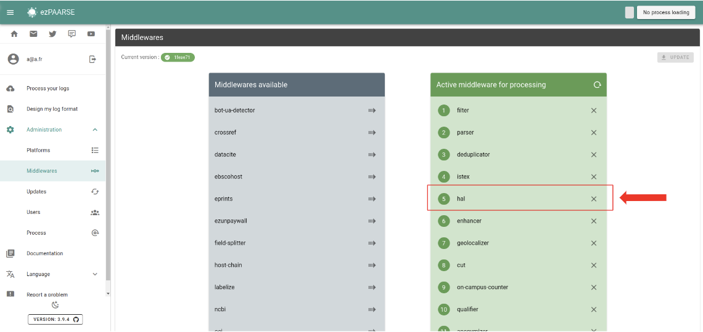
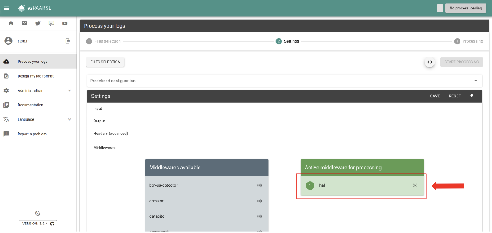

# hal

Fetches [HAL](https://hal.archives-ouvertes.fr/) data from their [API](https://api.archives-ouvertes.fr/docs/search)

**This middleware is activated by default.**

## Enriched fields

| Name | Type | Description |
| --- | --- | --- |
| publication_title | | |
| hal_consult_collection_sid | | |
| hal_endpoint_portail_sid | | |
| hal_endpoint_portail | | |
| hal_redirect_portail_sid | | |
| hal_redirect_portail | | |
| hal_identifiant | | |
| hal_tampons | | |
| hal_tampons_name | | |
| hal_domains | | |
| hal_sid | | |
| hal_redirection | | |
| hal_docid | String  | | |
| hal_consult_collection  | | |
| hal_fulltext | | |

The HAL middleware uses the ``hal-identifier`` found in the access events to request metadata using the [node-hal](https://www.npmjs.com/package/methal)

## Headers

+ **hal-enrich** : Set to ``true`` to enable HAL enrichment. Disabled by default.
hal-cache
+ **hal-ttl** : Lifetime of cached documents, in seconds. Defaults to ``7 days (3600 * 24 * 7)``.
+ **hal-throttle** : Minimum time to wait between queries, in milliseconds. Defaults to ``500``.
+ **hal-paquet-size** : 
+ **hal-buffer-siz** : 

## How to use

### ezPAARSE admin interface

You can add or remove hal by default to all your enrichments, To do this, go to the middleware section of administration.



### ezPAARSE process interface

You can use hel for an enrichment process. You just add the middleware.



### ezp

```bash
# enrich with one file
ezp process <path of your file> \
  --host <host of your ezPAARSE instance> \
  --settings <settings-id> \
  --header "ezPAARSE-Middlewares: hal" \
  --out ./result.csv

# enrich with multiples files
ezp bulk <path of your directory> \
  --host <host of your ezPAARSE instance> \
  --settings <settings-id> \
  --header "ezPAARSE-Middlewares: hal"

```

### curl

You can use hal for an enrichment process with curl like this:

```bash
curl -X POST -v http://localhost:59599 \
  -H "ezPAARSE-Middlewares: hal" \
  -H "Log-Format-Ezproxy: <line format>" \
  -F "file=@<log file path>"

```