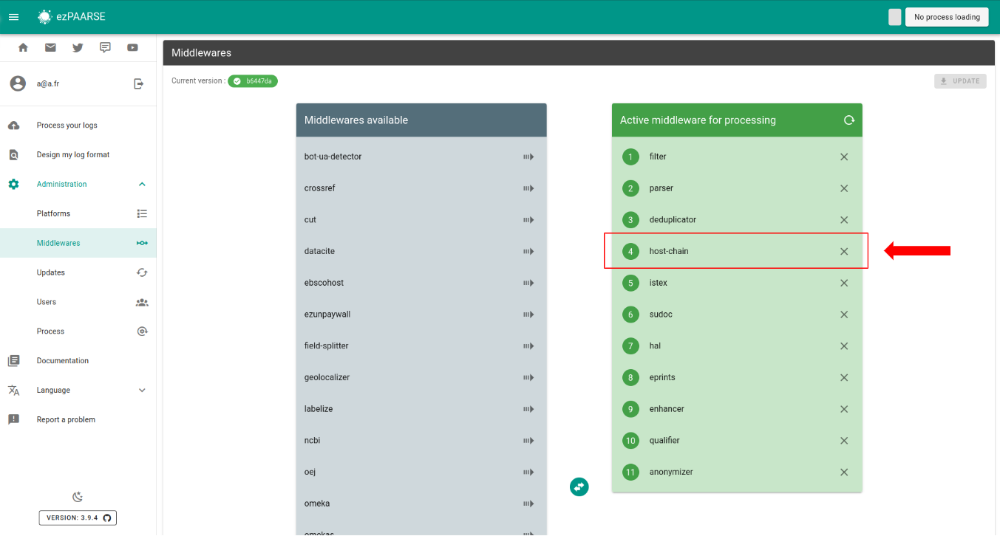
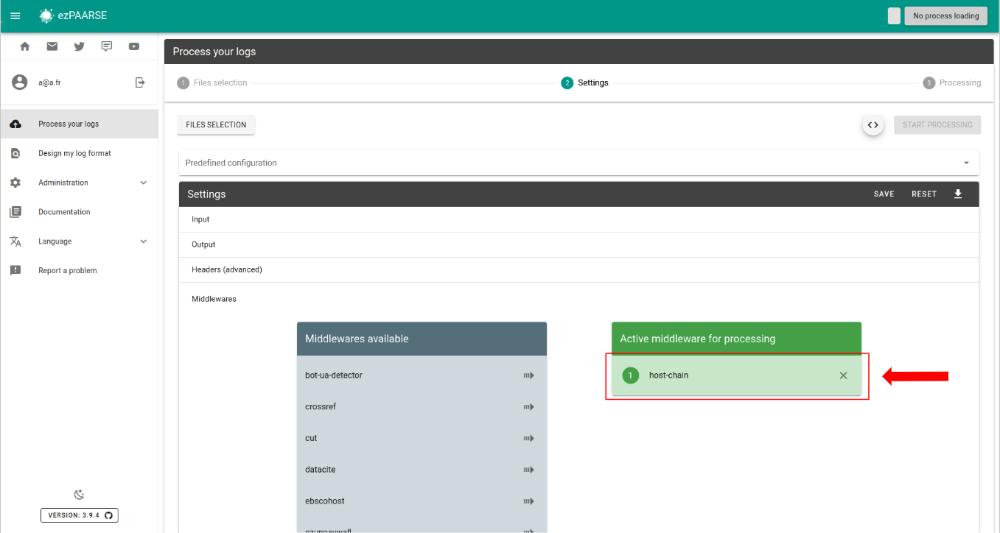

# host-chain

Split a chain of multiple IPs and only keep the first one. The original value is stored in another field.

## Headers

+ **host-chain-real-position** : position of the real IP. Defaults to the `first` one. Set it to `last` to keep the last IP of the chain.
+ **host-chain-field** : the field that contains the host. Defaults to `host`.
+ **host-chain-full-field** : the field that will contain the original value. Defaults to `full_host`.
+ **host-chain-separator** : the separator used to separate hosts. Defaults to `,`.

## Prerequisites

**You must use host-chain after filter, parser, deduplicator middleware.**

## How to use

### ezPAARSE admin interface

You can add or remove host-chain by default to all your enrichments, To do this, go to the middleware section of administration.



### ezPAARSE process interface

You can use host-chain for an enrichment process. You just add the middleware.



### ezp

```bash
# enrich with one file
ezp process <path of your file> \
  --host <host of your ezPAARSE instance> \
  --settings <settings-id> \
  --header "ezPAARSE-Middlewares: host-chain" \
  --out ./result.csv

# enrich with multiples files
ezp bulk <path of your directory> \
  --host <host of your ezPAARSE instance> \
  --settings <settings-id> \
  --header "ezPAARSE-Middlewares: host-chain" \

```

### curl

```bash
curl -X POST -v http://localhost:59599 \
  -H "ezPAARSE-Middlewares: host-chain" \
  -H "Log-Format-Ezproxy: <line format>" \
  -F "file=@<log file path>"

```