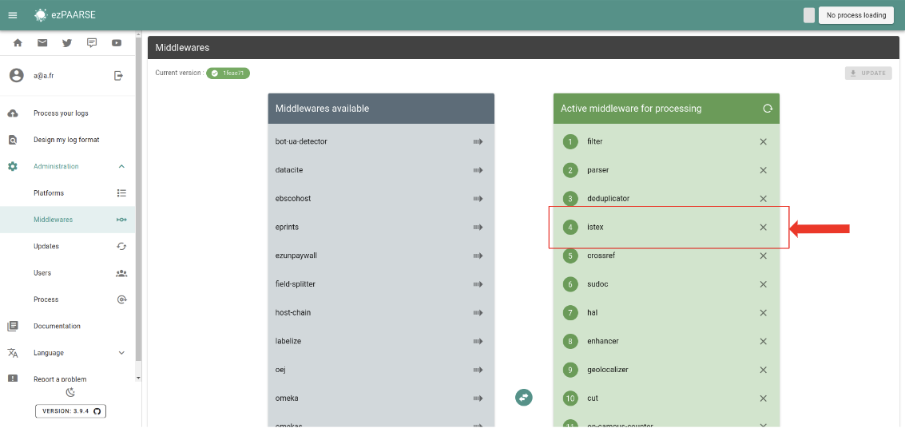

# istex

Middleware that fetches [istex](http://www.istex.fr/) data from their [API](https://api.istex.fr/documentation/).

**This middleware is activated by default.**

## Enriched fields

| Name | Type | Description |
| --- | --- | --- |
| mime | String | format of resource. (HTML, PDF, VIDEO, etc) |
| publication_title | String | Name of publication. | 
| publisher_name | String | Name of publisher. |
| print_identifier | Number | ISBN or ISSN. | 
| online_identifier | Number | EISBN or EISSN. | 
| subject | String | subject, thematic of resource. | 
| doi | String | DOI of resource. | 
| ark | String | ARK of resource. | 
| istex_genre | String | type of resource. (article, book, conference, thesis, report etc.) | 
| language | String | Lang of resource. | 

## Prerequisites

The ISTEX middleware uses the ``istex-identifier`` found in the access events to request metadata using the [node-istex](https://www.npmjs.com/package/node-istex).

**You must use istex after filter, parser, deduplicator middleware.**

## Headers

+ **istex-enrich** : Set to ``true`` to enable ISTEX enrichment. Disabled by default.
+ **istex-cache** : Enable/Disable cache.
+ **istex-ttl** : Lifetime of cached documents, in seconds. Defaults to ``7 days (3600 * 24 * 7)``.
+ **istex-throttle** : Minimum time to wait between queries, in milliseconds. Defaults to ``500``.
+ **istex-paquet-size** : Maximum number of identifiers to send for query in a single request. Defaults to ``50``.
+ **istex-buffer-size** : Maximum number of memorised access events before sending a request. Defaults to ``1000``.

## How to use

### ezPAARSE admin interface

You can add or remove istex by default to all your enrichments, To do this, go to the middleware section of administration.



### ezp

```bash
# enrich with one file

ezp process <path of your file> \
  --host <host of your ezPAARSE instance> \
  --settings <settings-id> \
  --header "ezPAARSE-Middlewares: istex" \
  --out ./result.csv

# enrich with multiples files

ezp bulk <path of your directory> \
  --host <host of your ezPAARSE instance> \
  --settings <settings-id> \
  --header "ezPAARSE-Middlewares: istex"

```

### curl

You can use istex for an enrichment process with curl like this

```bash
curl -X POST -v http://localhost:59599 \
  -H "ezPAARSE-Middlewares: istex" \
  -H "Log-Format-Ezproxy: <line format>" \
  -F "file=@/<log file path>"

```
