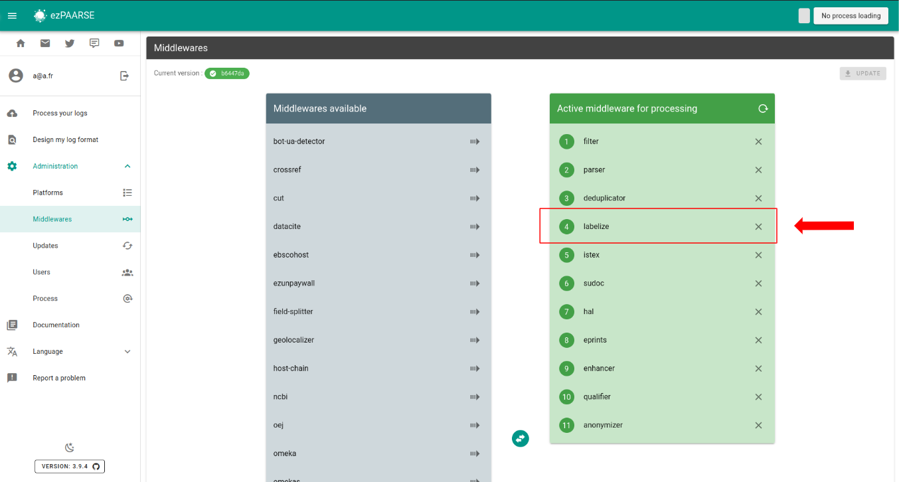
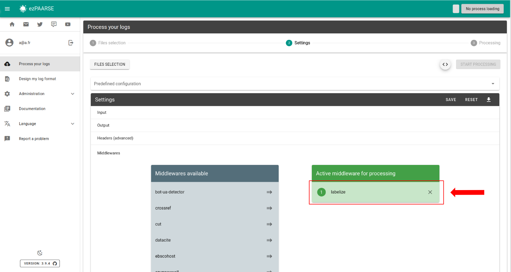

# labelize

This middleware allows you to add a field to based on the content of another field.

## Prerequisites

**You must use labelize after filter, parser, deduplicator middleware.**

## How to use

### ezPAARSE config

You can add or remove your labelize on ezpaarse config. It will be used on every process that used labelize middleware. You need to add this code on your `config.local.json`.

```json
{
  "EZPAARSE_LABELIZE": [
    {
      "from": "domain",
      "resultField": "organization",
      "mapping": {
        "psl.fr": "PSL",
        "paristech.com": "ParisTech",
        "dauphine.org": "Dauphine",
        "paris-dauphine.org": "Dauphine",
      }
    },
    {
      "from": "code",
      "resultField": "status",
      "mapping": {
        "200": true,
        "202": true,
        "400": false,
        "404": false,
      }
    },
  ]
  
}
```

### ezPAARSE admin interface

You can add or remove labelize by default to all your enrichments, provided you have added parameters in the config. To do this, go to the middleware section of administration.



### ezPAARSE process interface

You can use labelize for an enrichment process.



### ezp

You can use labelize for an enrichment process with [ezp](https://github.com/ezpaarse-project/node-ezpaarse) like this:

```bash
# enrich with one file
ezp process <path of your file> \
  --host <host of your ezPAARSE instance> \
  --settings <settings-id> \
  --header "ezPAARSE-Middlewares: labelize" \
  --out ./result.csv

# enrich with multiples files
ezp bulk <path of your directory> \
  --host <host of your ezPAARSE instance> \
  --settings <settings-id> \
  --header "ezPAARSE-Middlewares: labelize" 

```

### curl

You can use labelize for an enrichment process with curl like this:

```bash
curl -X POST -v http://localhost:59599 \
  -H "ezPAARSE-Middlewares: labelize" \
  -H "Log-Format-Ezproxy: <line format>" \
  -F "file=@<log file path>"

```


