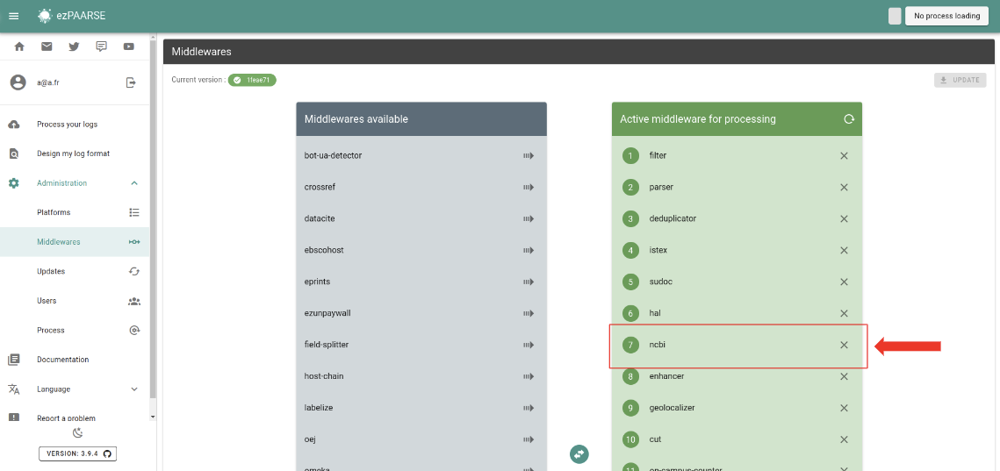
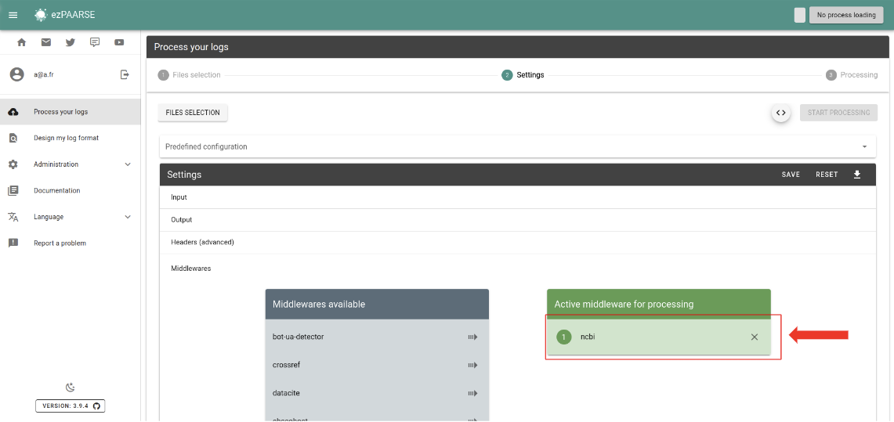

# ncbi

Fetches [ncbi](https://www.ncbi.nlm.nih.gov/) data from their [API](https://www.ncbi.nlm.nih.gov/books/NBK25501/).

## Enriched fields

| Name | Type | Description |
| --- | --- | --- |
| print_identifier | String | International Standard Serial Number for publications. |
| online_identifier | String | Electronic ISSN for publications. |
| publication_title | String | The full name of the journal. |
| doi | String | The digital object identifier. |
| title | String | The article title. |

## Prerequisites

The NCBI Enrichment middleware uses the ``unit_id`` found in NCBI access events to request Pubmed metadata

**You must use NCBI after filter, parser, deduplicator middleware.**

## Headers

+ **ncbi-cache** : Set to ``false`` to disable result caching. Enabled by default.
+ **ncbi-ttl** : Lifetime of cached documents, in seconds. Defaults to ``7 days (3600 * 24 * 7)``
+ **ncbi-throttle** : Minimum time to wait between each query, in milliseconds. Defaults to ``500``ms. Make no more than 3 requests per second unless you are registered with the NCBI API.
+ **ncbi-packet-size** : Maximum number of memorized NCBI access events before sending requests. Defaults to ``200``.
+ **ncbi-buffer-size** : Maximum number of memorized access events before sending requests. Defaults to ``1000``.
+ **ncbi-max-tries** : Maximum number of attempts if an enrichment fails. Defaults to ``5``.
+ **ncbi-email** : The email for reference for API calls. Defaults to ``ezteam@couperin.org`` (from config.json of ezPAARSE).  The email and tool can be registered with NCBI to increase the number of requests per second for the application.
+ **ncbi-tool** : The tool for reference for API calls. Defaults to ``ezPAARSE (https://readmetrics.org; mailto:ezteam@couperin.org)``.  The email and tool can be registered with NCBI to increase the number of requests per second for the application.
+ **ncbi-apikey** : Apikey for rights holders to speed up processing (10 requests per second)

## How to use

### ezPAARSE admin interface

You can add ncbi by default to all your enrichments, To do this, go to the middleware section of administration.



### ezPAARSE process interface

You can use ncbi for an enrichment process. You just add the middleware.



### ezp

You can use ncbi for an enrichment process with [ezp](https://github.com/ezpaarse-project/node-ezpaarse) like this:

```bash
# enrich with one file
ezp process <path of your file> \
  --host <host of your ezPAARSE instance> \
  --settings <settings-id> \
  --header "ezPAARSE-Middlewares: ncbi" \
  --out ./result.csv

# enrich with multiples files
ezp bulk <path of your directory> \
  --host <host of your ezPAARSE instance> \
  --settings <settings-id> \
  --header "ezPAARSE-Middlewares: ncbi" 

```

### curl

You can use ncbi for an enrichment process with curl like this:

```bash
curl -X POST -v http://localhost:59599 \
  -H "ezPAARSE-Middlewares: ncbi" \
  -H "Log-Format-Ezproxy: <line format>" \
  -F "file=@<log file path>"

```