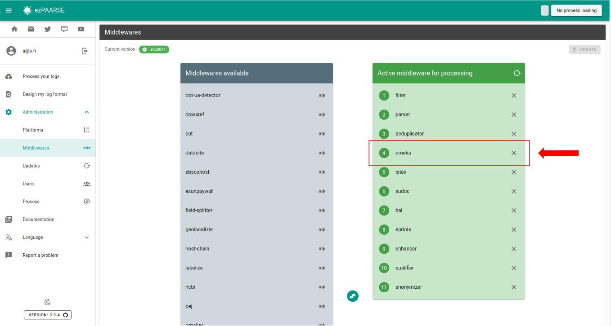
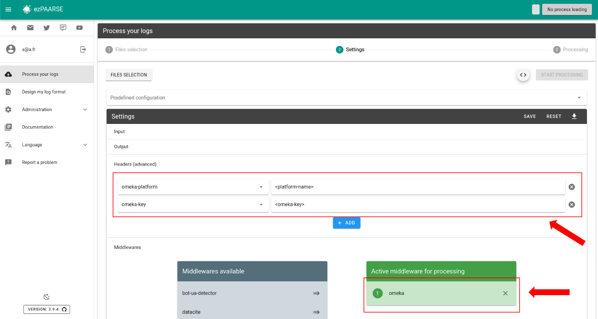

# omeka

Fetches metadata from platforms working with [Omeka](https://omeka.org). This middleware was designed for internal use at Inist-CNRS

## Enriched fields

| Name | Type | Description |
| --- | --- | --- |
| publication_title | String | Name of publication. |
| ark | String | ID ARK of this resource. |

## Prerequisites

This middleware can only be used to enrich one omeka platform per process. One of the keys corresponding to the platform name must be selected from this [file](https://github.com/ezpaarse-project/ezpaarse-middlewares/blob/master/omeka/manifest.json).
Your EC needs a omeka ID for enrichment. 
Some platforms may have private resources, to obtain enrichments on these platforms, It is necessary to enter a pair of API keys for each platform in the ezPAARSE processing configuration.

**You must use omeka after filter, parser, deduplicator middleware.**

## Headers

+ **omeka-platform** : name of platform selected from this [file](https://github.com/ezpaarse-project/ezpaarse-middlewares/blob/master/omeka/manifest.json).
+ **omeka-cache** : Enable/Disable cache.
+ **omeka-ttl** : Lifetime of cached documents, in seconds. Defaults to ``7 days (3600 * 24 * 7)``.
+ **omeka-throttle** : Minimum time to wait between queries, in milliseconds. Defaults to ``200``ms.
+ **omeka-base-wait-time** : Time to wait before retrying after a query fails, in milliseconds. Defaults to ``1000``ms. This time ``doubles`` after each attempt.
+ **omeka-max-tries** : Maximum number of attempts if an enrichment fails. Defaults to ``5``.
+ **omeka-key** : apikey to access private resource metada.

## How to use

### ezPAARSE admin interface

You can add omeka by default to all your enrichments, To do this, go to the middleware section of administration.




### ezPAARSE process interface

You can use omeka for an enrichment process. You just add the middleware.



### ezp

You can use omeka for an enrichment process with [ezp](https://github.com/ezpaarse-project/node-ezpaarse) like this:

```bash
# enrich with one file
ezp process <path of your file> \
  --host <host of your ezPAARSE instance> \
  --settings <settings-id> \
  --header "ezPAARSE-Middlewares: omeka" \
  --header "omeka-platform: <platform name>" \
  --header "omeka-key: <apikey of omeka platform>" \
  --out ./result.csv

# enrich with multiples files
ezp bulk <path of your directory> \
  --host <host of your ezPAARSE instance> \
  --settings <settings-id> \
  --header "ezPAARSE-Middlewares: omeka" \
  --header "omeka-platform: <platform name>" \
  --header "omeka-key: <apikey of omeka platform>" 

```

### curl

You can use omeka for an enrichment process with curl like this:

```bash
curl -X POST -v http://localhost:59599 \
  -H "ezPAARSE-Middlewares: omeka" \
  -H "omeka-platform: <platform name>" \
  -H "omeka-key: <apikey of omeka platform>" \
  -H "Log-Format-Ezproxy: <line format>" \
  -F "file=@<log file path>"

```