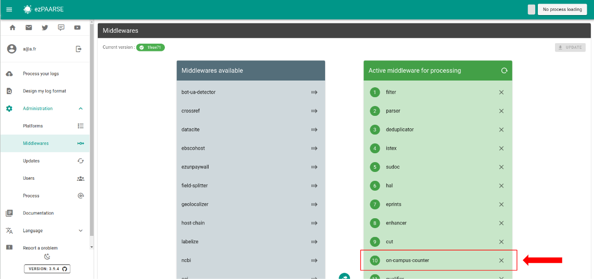
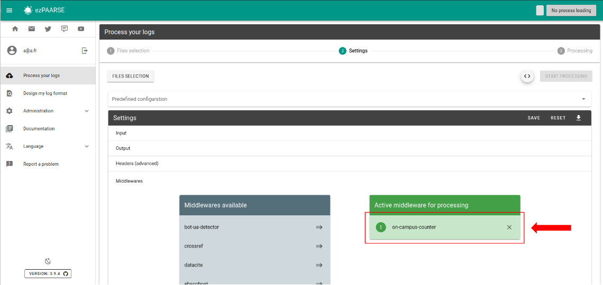

# on-campus-counter

This middleware adds an `on_campus` field containing `Y` or `N` depending on the IP contained in the `host` field. It also increments two counters in the report : `on-campus-accesses` and `off-campus-accesses`.


## Enriched fields

| Name | Type | Description |
| --- | --- | --- |
| on_campus | String | Name of publication. |

## Prerequisites

By default, only [private IPv4 addresses](https://en.wikipedia.org/wiki/Private_network#Private_IPv4_address_spaces) are considered on-campus. More ranges can be added by providing an `onCampusCounter` key in the ezPAARSE configuration (`config.local.json`).

`onCampusCounter` should be an array, where each element is either a valid range string, or an object with a string property `label` and an array property `ranges` containing valid range strings. Ranges also accept single IPv4 addresses.

When a range is associated with a label, `on_campus` will contain the label instead of `Y`.

## How to use

### ezPAARSE config

You can add or remove your on-campus-counter on ezpaarse config. It will be used on every process that used on-campus-counter middleware. You need to add this code on your `config.local.json`.

```json
{
  "onCampusCounter": [
    "115.0.0.0/8",
    {
      "label": "Campus name",
      "ranges": ["93.25.0.0/16", "118.0.0.0/8", "83.112.9.15"]
    }
  ]
}
```

### ezPAARSE admin interface

You can add or remove on-campus-counter by default to all your enrichments, provided you have added an API key in the config. To do this, go to the middleware section of administration.



### ezPAARSE process interface

You can use on-campus-counter for an enrichment process. You just add the middleware and enter the API key.



### ezp

You can use on-campus-counter for an enrichment process with [ezp](https://github.com/ezpaarse-project/node-ezpaarse) like this.

```bash
# enrich with one file

ezp process <path of your file> \
  --host <host of your ezPAARSE instance> \
  --settings <settings-id> \
  --header "ezPAARSE-Middlewares: on-campus-counter" \
  --out ./result.csv

# enrich with multiples files

ezp bulk <path of your directory> \
  --host <host of your ezPAARSE instance> \
  --settings <settings-id> \
  --header "ezPAARSE-Middlewares: on-campus-counter" 

```

### curl

You can use on-campus-counter for an enrichment process with curl like this

```bash
curl -X POST -v http://localhost:59599 \
  -H "ezPAARSE-Middlewares: on-campus-counter" \
  -H "Log-Format-Ezproxy: <line format>" \
  -F "file=@/<log file path>"

```