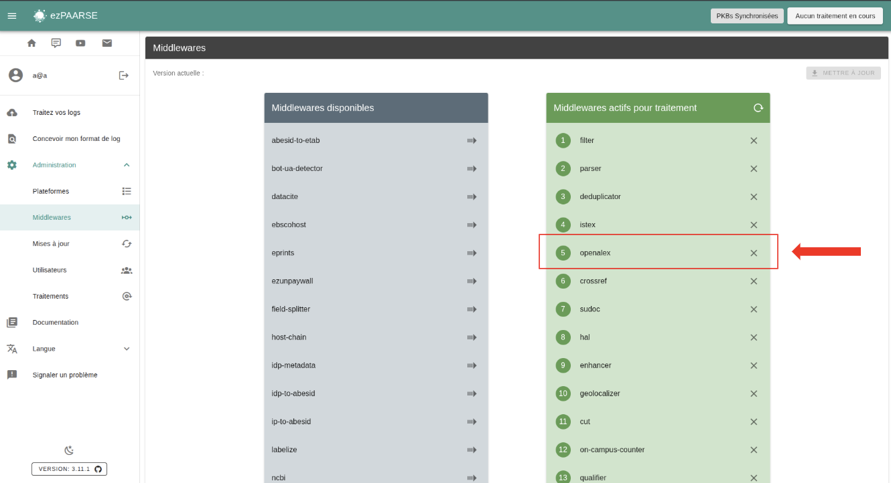
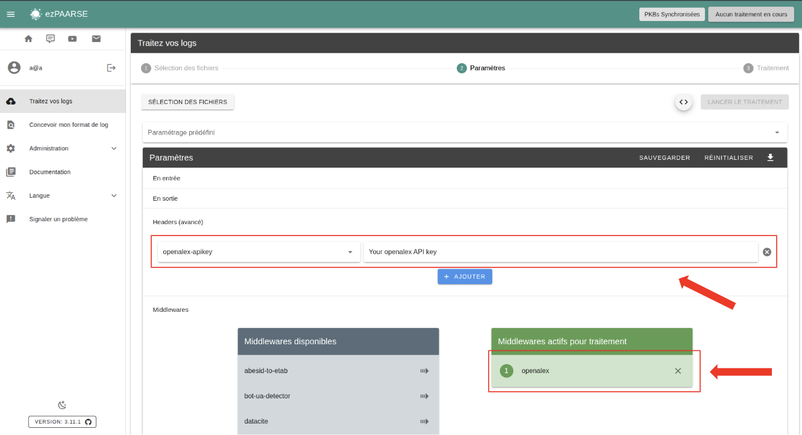

# openalex

Fetches [openalex](https://docs.openalex.org/) metadata.

## Enriched fields

| Name | Type | Description |
| --- | --- | --- |
| publication_title | String | Name of publication. |
| publication_date | String | Publication date |
| language | String | language of ressource |
| is_oa | Boolean | Is there an OA copy of this resource. |
| oa_status | String | The OA status, or color, of this resource. |
| journal_is_in_doaj | Boolean | Is this resource published in a DOAJ-indexed journal. |
| issnl | String | linking ISSN |
| type | String | genre, equivalent to type on crossref |
| journal_is_oa | Boolean | Is this resource published in a completely OA journal. |
| oa_request_date | Date | Date of open access information. |

## Prerequisites

Your EC needs a DOI for enrichment.
**Open access information is valid for EC generated on the same day**. Unpaywall data does not retain open access history.

**You must use openalex after filter, parser, deduplicator middleware.**

## Headers

+ **openalex-cache** : Enable/Disable cache.
+ **openalex-ttl** : Lifetime of cached documents, in seconds. Defaults to ``7 days (3600 * 24 * 7)``.
+ **openalex-throttle** : Minimum time to wait between queries, in milliseconds. Defaults to ``100``ms.
+ **openalex-paquet-size** : Maximum number of identifiers to send for query in a single request. Defaults to ``100``.
+ **openalex-buffer-size** : Maximum number of memorized access events before sending a request. Defaults to ``1000``.
+ **openalex-max-attempts** : Maximum number of trials before passing the EC in error. Defaults to ``5``.
+ **openalex-apikey** : apikey to use openalex.

## How to use

### ezPAARSE config

You can add or remove your openalex on ezpaarse config. It will be used on every process that used openalex middleware. You need to add this code on your `config.local.json`.

```json
{
  "EZPAARSE_DEFAULT_HEADERS": {
    "openalex-apikey": "<openalex apikey>"
  }
}
```

### ezPAARSE admin interface

You can add or remove openalex by default to all your enrichments, provided you have added an API key in the config. To do this, go to the middleware section of administration.



### ezPAARSE process interface

You can use openalex for an enrichment process. You just add the middleware and enter the API key.



### ezp

You can use openalex for an enrichment process with [ezp](https://github.com/ezpaarse-project/node-ezpaarse) like this:

```bash
# enrich with one file
ezp process <path of your file> \
  --host <host of your ezPAARSE instance> \
  --settings <settings-id> \
  --header "ezPAARSE-Middlewares: openalex" \
  --header "openalex-apikey: <openalex apikey>" \
  --out ./result.csv

# enrich with multiples files
ezp bulk <path of your directory> \
  --host <host of your ezPAARSE instance> \
  --settings <settings-id> \
  --header "ezPAARSE-Middlewares: openalex" \
  --header "openalex-apikey: <openalex apikey>"
```

### curl

You can use openalex for an enrichment process with curl like this:

```bash
curl -X POST -v http://localhost:59599 \
  -H "ezPAARSE-Middlewares: openalex" \
  -H "openalex-apikey: <openalex apikey>" \
  -H "Log-Format-Ezproxy: <line format>" \
  -F "file=@<log file path>"
```
