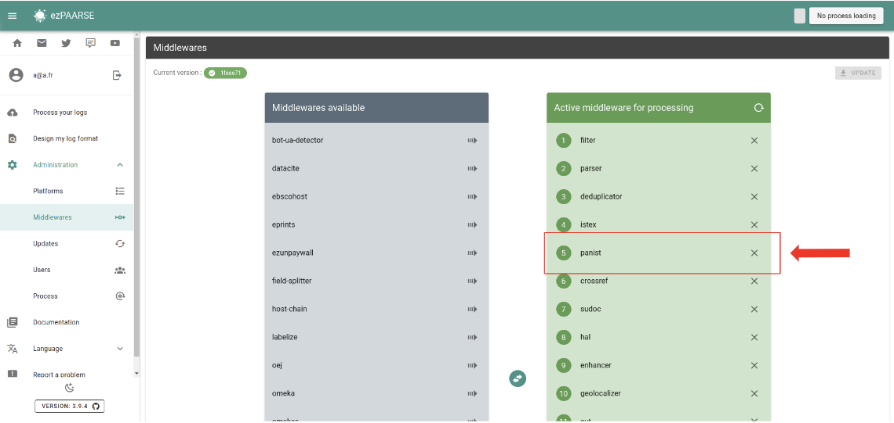
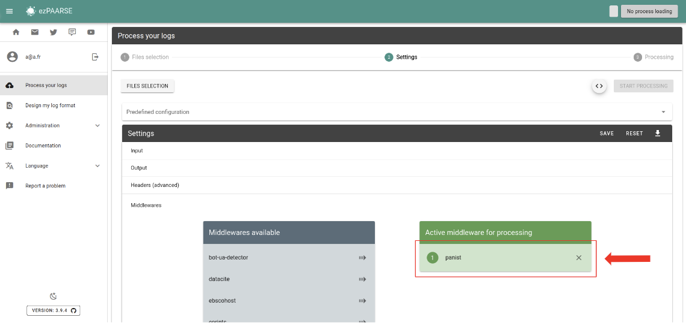

# panist

Middleware that fetches [panist](http://www.panist.fr/)

## Enriched fields

| Name | Type | Description |
| --- | --- | --- |
| mime | String | type of document (HTML, PDF, VIDEO, etc) |
| publication_title | String | Name of publication. | 
| publisher_name | String | Name of publisher. |
| print_identifier | Number | ISBN or ISSN. | 
| online_identifier | Number | EISBN or EISSN. | 
| subject | String | | 
| doi | String | DOI of publication. | 
| ark | String | ARK of publication. | 
| istex_genre | String | genre of publication. | 
| language | String | Lang of publication |

## Prerequisites

The ISTEX middleware uses the ``istex-identifier`` found in the access events to request metadata using the [node-istex](https://www.npmjs.com/package/node-istex).

**You must use panist after filter, parser, deduplicator middleware.**

## Headers

+ **panist-enrich** : Set to ``false`` to disable PANIST enrichment. Enabled by default.
+ **panist-cache** : Enable/Disable cache.
+ **panist-ttl** : Lifetime of cached documents, in seconds. Defaults to ``7 days (3600 * 24 * 7)``.
+ **panist-throttle** : Minimum time to wait between queries, in milliseconds. Defaults to ``200``ms.
+ **panist-paquet-size** : Maximum number of identifiers to send for query in a single request. Defaults to ``50``.
+ **panist-buffer-size** : Maximum number of memorised access events before sending a request. Defaults to ``1000``.

## How to use

### ezPAARSE admin interface

You can add or remove panist by default to all your enrichments, To do this, go to the middleware section of administration.




### ezPAARSE process interface

You can use panist for an enrichment process. You just add the middleware.



### ezp

```bash
# enrich with one file

ezp process <path of your file> \
  --host <host of your ezPAARSE instance> \
  --settings <settings-id> \
  --header "ezPAARSE-Middlewares: panist" \
  --out ./result.csv

# enrich with multiples files

ezp bulk <path of your directory> \
  --host <host of your ezPAARSE instance> \
  --settings <settings-id> \
  --header "ezPAARSE-Middlewares: panist"

```

### curl

You can use panist for an enrichment process with curl like this

```bash
curl -X POST -v http://localhost:59599 \
  -H "ezPAARSE-Middlewares: panist" \
  -H "Log-Format-Ezproxy: <line format>" \
  -F "file=@/<log file path>"

```