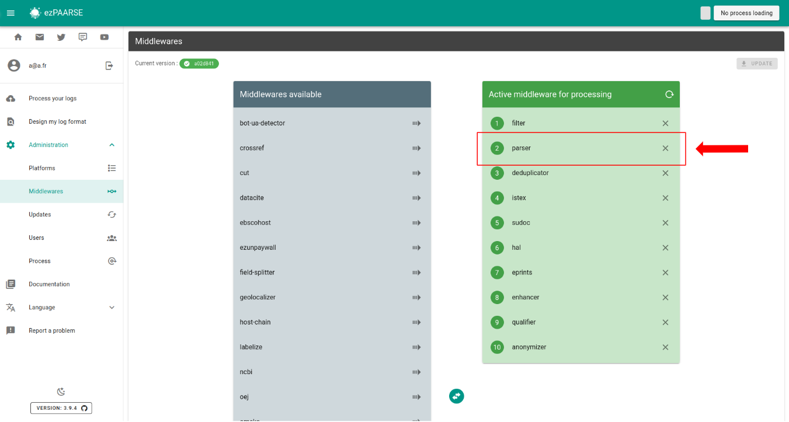
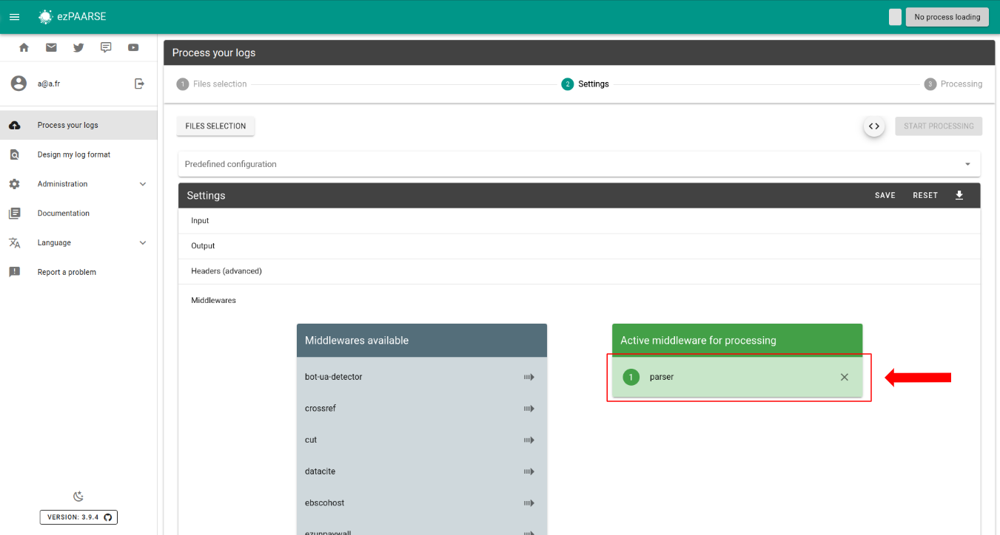

# parser

Parses the URL associated with a consultation event (by calling the appropriate parser).

**This middleware is activated by default.**

## Headers

+ **filter-platforms** : comma-separated list of platforms to handle. Lines with a matching parser that is not specified are considered irrelevant and filtered out.
+ **allow-domain-wildcards** : set to `true` to allow domain wildcards when looking for parsers associated with a domain. For example, a parser with `*.google.com` in its manifest will handle `google.com` as well as `www.google.com`.

## How to use

### ezPAARSE admin interface

You can add or remove parser by default to all your enrichments, To do this, go to the middleware section of administration.



### ezPAARSE process interface

You can use parser for an enrichment process. You just add the middleware.



### ezp

```bash
# enrich with one file
ezp process <path of your file> \
  --host <host of your ezPAARSE instance> \
  --settings <settings-id> \
  --header "ezPAARSE-Middlewares: parser" \
  --out ./result.csv

# enrich with multiples files
ezp bulk <path of your directory> \
  --host <host of your ezPAARSE instance> \
  --settings <settings-id> \
  --header "ezPAARSE-Middlewares: parser"

```

### curl

You can use parser for an enrichment process with curl like this:

```bash
curl -X POST -v http://localhost:59599 \
  -H "ezPAARSE-Middlewares: parser" \
  -H "Log-Format-Ezproxy: <line format>" \
  -F "file=@<log file path>"

```
