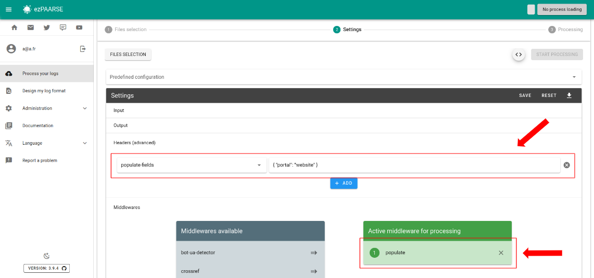

# populate

Allows for populating fields with arbitrary data. To use it, set the header `Populate-Fields` with a JSON representation of the fields that should be populated. Any JSON compliant value will be affected to the EC with the corresponding key.

## Prerequisites

**You must use populate after filter, parser, deduplicator middleware.**

## Headers

+ **populate-fields** : JSON that insert key as value and value as column in EC 

## How to use

### Example
Insert `website` into the field `portal`.

```
Populate-Fields: { "portal": "website" }
```

### ezPAARSE process interface

You can use populate for an enrichment process.



### ezp

You can use populate for an enrichment process with [ezp](https://github.com/ezpaarse-project/node-ezpaarse) like this:

```bash
# enrich with one file
ezp process <path of your file> \
  --host <host of your ezPAARSE instance> \
  --settings <settings-id> \
  --header "ezPAARSE-Middlewares: populate" \
  --header "Populate-Fields: { \"portal\": \"website\" }" \
  --out ./result.csv

# enrich with multiples files
ezp bulk <path of your directory> \
  --host <host of your ezPAARSE instance> \
  --settings <settings-id> \
  --header "ezPAARSE-Middlewares: populate" \
  --header "Populate-Fields: { \"portal\": \"website\" }"

```

### curl

You can use populate for an enrichment process with curl like this:

```bash
curl -X POST -v http://localhost:59599 \
  -H "ezPAARSE-Middlewares: populate" \
  -H "Populate-Fields: { \"portal\": \"website\" }" \
  -H "Log-Format-Ezproxy: <line format>" \
  -F "file=@<log file path>"

```
