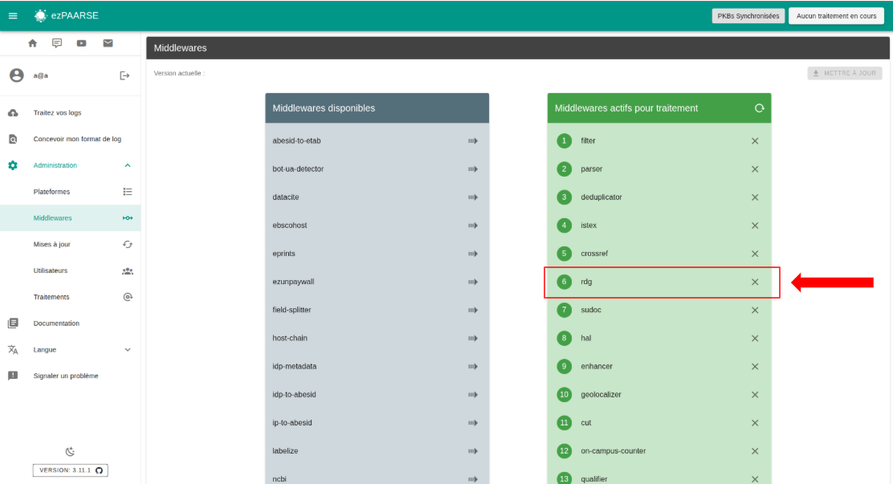
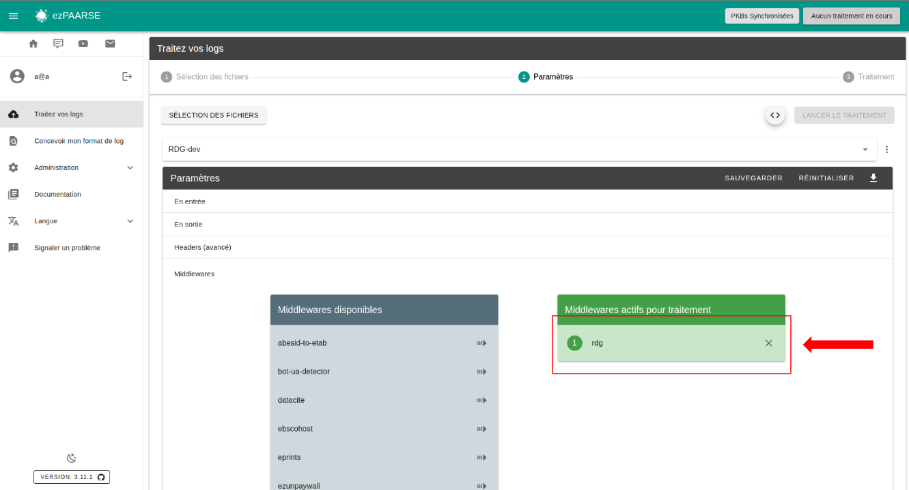

# rdg

Fetches [RDG API](https://entrepot.recherche.data.gouv.fr/) metadata

## Enriched fields

| Name | Type | Description |
| --- | --- | --- |
| publication_title | String | Name of publication. |
| citation | String | group of authors, title, city, publication_year. |

## Prerequisites

Your EC needs a DOI for enrichment.

**You must use rdg after filter, parser, deduplicator middleware.**

## Headers

+ **rdg-cache** : Set to ``false`` to disable result caching. Enabled by default.
+ **rdg-on-fail** : Strategy to adopt if an enrichment reaches the maximum number of attempts. Can be either of ``abort``, ``ignore`` or ``retry``. Defaults to ``abort``.
+ **rdg-TTL** : Lifetime of cached documents, in seconds. Defaults to ``7 days (3600 * 24 * 7)``
+ **rdg-throttle** : Minimum time to wait between each query, in milliseconds. Defaults to ``100``ms. Throttle time ``doubles`` after each failed attempt.
+ **rdg-paquet-size** : Maximum number of DOIs to request in parallel. Defaults to ``10``
+ **rdg-max-tries** : Maximum number of attempts if an enrichment fails. Defaults to ``5``.

## How to use

### ezPAARSE admin interface

You can add rdg by default to all your enrichments, To do this, go to the middleware section of administration.



### ezPAARSE process interface

You can use rdg for an enrichment process. You just add the middleware.



### ezp

You can use rdg for an enrichment process with [ezp](https://github.com/ezpaarse-project/node-ezpaarse) like this:

```bash
# enrich with one file
ezp process <path of your file> \
  --host <host of your ezPAARSE instance> \
  --settings <settings-id> \
  --header "ezPAARSE-Middlewares: rdg" \
  --out ./result.csv

# enrich with multiples files
ezp bulk <path of your directory> \
  --host <host of your ezPAARSE instance> \
  --settings <settings-id> \
  --header "ezPAARSE-Middlewares: rdg" 

```

### curl

You can use rdg for an enrichment process with curl like this:

```bash
curl -X POST -v http://localhost:59599 \
  -H "ezPAARSE-Middlewares: rdg" \
  -H "Log-Format-Ezproxy: <line format>" \
  -F "file=@<log file path>"

```
