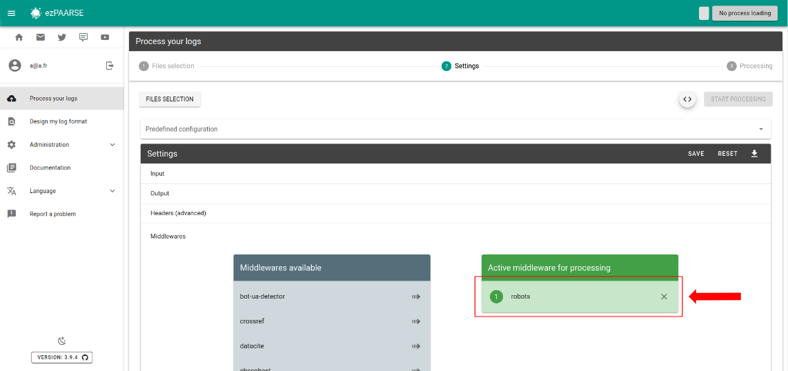

# robots

Generates a file (``robots.json``) which contains a list of trackcodes that have done N lookups and appear to be robots.

## Headers

+ **robots-ttl** : Lifetime of cached documents, in seconds. Defaults to ``1 day (3600 * 24)``.
+ **robots-threshold** : Maximum threshold. Defaults to ``100``.

## Prerequisites

Your EC needs a trackcode for enrichment.

**You must use robots after filter, parser, deduplicator middleware.**

## How to use

### ezPAARSE process interface

You can use robots for an enrichment process.



### ezp

You can use robots for an enrichment process with [ezp](https://github.com/ezpaarse-project/node-ezpaarse) like this.

```bash
# enrich with one file

ezp process <path of your file> \
  --host <host of your ezPAARSE instance> \
  --settings <settings-id> \
  --header "ezPAARSE-Middlewares: robots" \
  --out ./result.csv

# enrich with multiples files

ezp bulk <path of your directory> \
  --host <host of your ezPAARSE instance> \
  --settings <settings-id> \
  --header "ezPAARSE-Middlewares: robots" 

```

### curl

You can use robots for an enrichment process with curl like this

```bash
curl -X POST -v http://localhost:59599 \
  -H "ezPAARSE-Middlewares: robots" \
  -H "Log-Format-Ezproxy: <line format>" \
  -F "file=@/<log file path>"

```