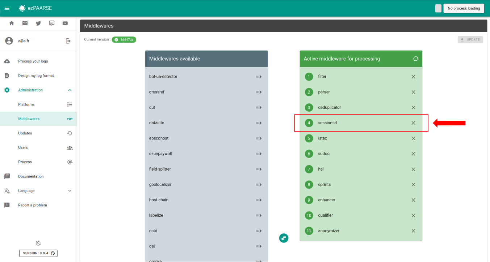
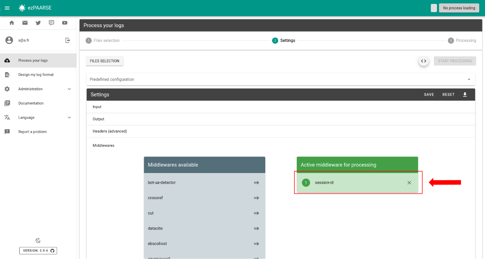

# session-id

Generate a COUNTER compliant user ID and session ID in the fields `user_id` and `session_id`.

## Prerequisites

The user ID can be one of the following, by order of priority :
  - the user login (default field: login)
  - the cookie ID (default field: cookie)
  - both the IP (default field: host) and the user agent (default field: user-agent)

The session ID is generated by concatenating the date, hour of day, and user ID.

Default fields can be changed with the [Session-ID-Fields](../../configuration/parametres.html#session-id-fields) header.

Examples of generated user IDs :
  - john.doe
  - 157.244.176.142|Opera/9.80 (X11; Linux i686; U; ru) Presto/2.8.131 Version/11.11

Examples of generated session IDs :
  - 2019-06-09|08|john.doe
  - 2018-12-25|00|157.244.176.142|Opera/9.80 (X11; Linux i686; U; ru) Presto/2.8.131 Version/11.11

**You must use session-id after filter, parser, deduplicator middleware.**

## Headers

+ **session-id-fields** : custom key assigned to a value, example: "userid: userid" or "userid: iduser" or "userid: iduser, user: idaccount"

## How to use

### ezPAARSE admin interface

You can add or remove session-id by default to all your enrichments, To do this, go to the middleware section of administration.



### ezPAARSE process interface

You can use session-id for an enrichment process.



### ezp

You can use session-id for an enrichment process with [ezp](https://github.com/ezpaarse-project/node-ezpaarse) like this:

```bash
# enrich with one file
ezp process <path of your file> \
  --host <host of your ezPAARSE instance> \
  --settings <settings-id> \
  --header "ezPAARSE-Middlewares: session-id" \
  --out ./result.csv

# enrich with multiples files
ezp bulk <path of your directory> \
  --host <host of your ezPAARSE instance> \
  --settings <settings-id> \
  --header "ezPAARSE-Middlewares: session-id" 

```

### curl

You can use session-id for an enrichment process with curl like this:

```bash
curl -X POST -v http://localhost:59599 \
  -H "ezPAARSE-Middlewares: session-id" \
  -H "Log-Format-Ezproxy: <line format>" \
  -F "file=@<log file path>"

```

