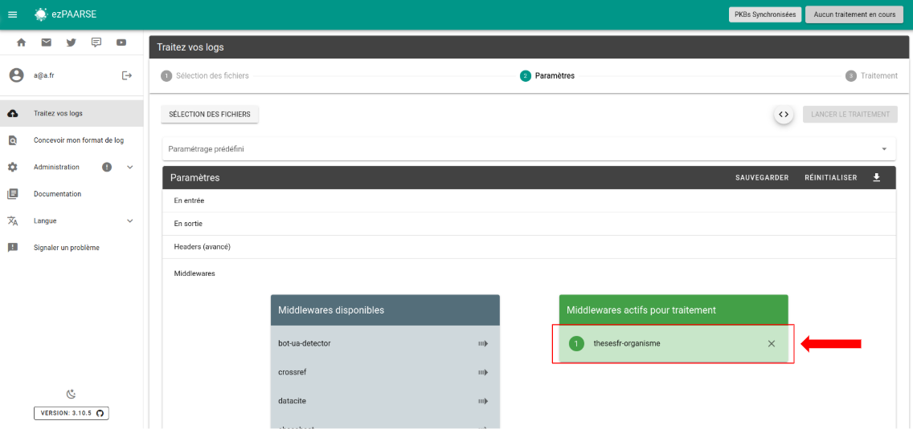

# thesesfr-organisme

Fetches thesesfr-organisme API from ABES.
This middleware is used only for log from these.fr.

## Enriched fields

| Name | Type | Description |
| --- | --- | --- |
| rtype | string | |
| nnt | string | |
| numSujet | string | |
| etabSoutenanceN | string | |
| etabSoutenancePpn | string | |
| codeCourt | string | |
| dateSoutenance | string | |
| anneeSoutenance | string | |
| dateInscription | string | |
| anneeInscription | string | |
| statut | string | |
| discipline | string | |
| ecoleDoctoraleN | string | |
| ecoleDoctoralePpn | string | |
| partenaireRechercheN | string | |
| partenaireRecherchePpn | string | |
| auteurN | string | |
| auteurPpn | string | |
| directeurN | string | |
| directeurPpn | string | |
| presidentN | string | |
| presidentPpn | string | |
| rapporteursN | string | |
| rapporteursPpn | string | |
| membresN | string | |
| membresPpn | string | |
| personneN | string | |
| personnePpn | string | |
| organismeN | string | |
| organismePpn | string | |
| idp_etab_nom | string | |
| idp_etab_ppn | string | |
| idp_etab_code_court | string | |
| platform_name | string | |
| publication_title | string | |
| accessible | string | coming soon |
| source | string | coming soon |
| domain | string | coming soon |
| langue | string | coming soon |

## Prerequisites

**You must use thesesfr-organisme after filter, parser, deduplicator middleware.**

## Recommendation

This middleware should be used after thesesfr and thesesfr-organisme.

## Headers

+ **thesesfr-organisme-ttl** : Lifetime of cached documents, in seconds. Defaults to ``7 days (3600 * 24 * 7)``.
+ **thesesfr-organisme-throttle** : Minimum time to wait between queries, in milliseconds. Defaults to ``200``ms.
+ **thesesfr-organisme-base-wait-time** : Time to wait before retrying after a query fails, in milliseconds. Defaults to ``1000``ms. This time ``doubles`` after each attempt.
+ **thesesfr-organisme-paquet-size** : Maximum number of identifiers to send for query in a single request. Defaults to ``50``.
+ **thesesfr-organisme-buffer-size** : Maximum number of memorized access events before sending a request. Defaults to ``1000``.
+ **thesesfr-organisme-max-attempts** : Maximum number of trials before passing the EC in error. Defaults to ``5``.
+ **thesesfr-organisme-user-agent** : Specify what to send in the `User-Agent` header when querying thesesfr-organisme. Defaults to `ezPAARSE (https://readmetrics.org; mailto:ezteam@couperin.org)`.

## How to use

### ezPAARSE admin interface

You can add or remove thesesfr-organisme by default to all your enrichments, provided you have added an API key in the config. To do this, go to the middleware section of administration.


### ezPAARSE process interface

You can use thesesfr-organisme for an enrichment process. You just add the middleware



### ezp

You can use thesesfr-organisme for an enrichment process with [ezp](https://github.com/ezpaarse-project/node-ezpaarse) like this:

```bash
# enrich with one file
ezp process <path of your file> \
  --host <host of your ezPAARSE instance> \
  --settings <settings-id> \
  --header "ezPAARSE-Middlewares: thesesfr-organisme" 
  --out ./result.csv

# enrich with multiples files
ezp bulk <path of your directory> \
  --host <host of your ezPAARSE instance> \
  --settings <settings-id> \
  --header "ezPAARSE-Middlewares: thesesfr-organisme" 

```

### curl

You can use thesesfr-organisme for an enrichment process with curl like this:

```bash
curl -X POST -v http://localhost:59599 \
  -H "ezPAARSE-Middlewares: thesesfr-organisme" \
  -H "Log-Format-Ezproxy: <line format>" \
  -F "file=@<log file path>"

```