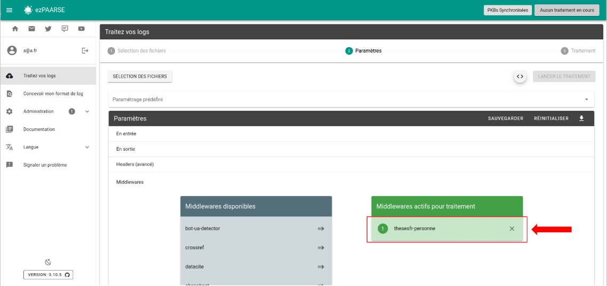

# thesesfr-personne

Fetches thesesfr-personne API from ABES.
This middleware is used only for log from these.fr.

## Enriched fields

| Name | Type   | Description |
| --- |--------| --- |
| rtype | String | type of consultation (BIO = person notice viewed; RECORD = in process) |
| nnt | String | "sans objet" (irrelevant) |
| numSujet | String | "sans objet" (irrelevant) |
| etabSoutenanceN | String | "sans objet" (irrelevant) |
| etabSoutenancePpn | String | "sans objet" (irrelevant) |
| codeCourt | String | "sans objet" (irrelevant) |
| dateSoutenance | String | "sans objet" (irrelevant) |
| anneeSoutenance | String | "sans objet" (irrelevant) |
| dateInscription | String | "sans objet" (irrelevant) |
| anneeInscription | String | "sans objet" (irrelevant) |
| statut | String | "sans objet" (irrelevant) |
| discipline | String | "sans objet" (irrelevant) |
| ecoleDoctoraleN | String | "sans objet" (irrelevant) |
| ecoleDoctoralePpn | String | "sans objet" (irrelevant) |
| partenaireRechercheN | String | "sans objet" (irrelevant) |
| partenaireRecherchePpn | String | "sans objet" (irrelevant) |
| auteurN | String | "sans objet" (irrelevant) |
| auteurPpn | String | "sans objet" (irrelevant) |
| directeurN | String | "sans objet" (irrelevant) |
| directeurPpn | String | "sans objet" (irrelevant) |
| presidentN | String | "sans objet" (irrelevant) |
| presidentPpn | String | "sans objet" (irrelevant) |
| rapporteursN | String | "sans objet" (irrelevant) |
| rapporteursPpn | String | "sans objet" (irrelevant) |
| membresN | String | "sans objet" (irrelevant) |
| membresPpn | String | "sans objet" (irrelevant) |
| personneN | String | name of the person regardless of their role (author, supervisor, jury member, rapporteur, jury president, etc.) |
| personnePpn | String | identifier (PPN) of the person regardless of their role (author, supervisor, jury member, rapporteur, jury president, etc.) |
| organismeN | String | "sans objet" (irrelevant) |
| organismePpn | String | "sans objet" (irrelevant) |
| idp_etab_nom | String | "sans objet" (irrelevant) |
| idp_etab_ppn | String | "sans objet" (irrelevant) |
| idp_etab_code_court | String | "sans objet" (irrelevant) |
| platform_name | String | "sans objet" (irrelevant) |
| publication_title | String | "sans objet" (irrelevant) |
| source | String | Upcoming : data source: STEP, STAR, Sudoc |
| domaine | String | Upcoming : thematic domain associated with the thesis |
| doiThese | String | Upcoming : DOI assigned to the thesis |
| accessible | String | Upcoming : is the thesis accessible online: yes or no |
| langue | String | Upcoming : language of the thesis writing | 

## Prerequisites

Ec needs unitid and rtype equal to RECORD.

**You must use thesesfr-personne after filter, parser, deduplicator middleware.**

**You must use the 3 middlewares at once, in this order : thesesfr, thesesfr-personne, thesesfr-organisme**  
``` -H "ezPAARSE-Middlewares: thesesfr,thesesfr-personne,thesesfr-organisme" ```

## Recommendation

This middleware should be used after thesesfr and before thesesfr-organisme.

## Headers

+ **thesesfr-personne-ttl** : Lifetime of cached documents, in seconds. Defaults to ``7 days (3600 * 24 * 7)``.
+ **thesesfr-personne-throttle** : Minimum time to wait between queries, in milliseconds. Defaults to ``200``ms.
+ **thesesfr-personne-base-wait-time** : Time to wait before retrying after a query fails, in milliseconds. Defaults to ``1000``ms. This time ``doubles`` after each attempt.
+ **thesesfr-personne-paquet-size** : Maximum number of identifiers to send for query in a single request. Defaults to ``50``.
+ **thesesfr-personne-buffer-size** : Maximum number of memorized access events before sending a request. Defaults to ``1000``.
+ **thesesfr-personne-max-attempts** : Maximum number of trials before passing the EC in error. Defaults to ``5``.
+ **thesesfr-personne-user-agent** : Specify what to send in the `User-Agent` header when querying thesesfr-personne. Defaults to `ezPAARSE (https://readmetrics.org; mailto:ezteam@couperin.org)`.

## How to use

### ezPAARSE admin interface

You can add or remove thesesfr-personne by default to all your enrichments, provided you have added an API key in the config. To do this, go to the middleware section of administration.


### ezPAARSE process interface

You can use thesesfr-personne for an enrichment process. You just add the middleware



### ezp

You can use thesesfr for an enrichment process with [ezp](https://github.com/ezpaarse-project/node-ezpaarse) like this:

```bash
# enrich with one file
ezp process <path of your file> \
  --host <host of your ezPAARSE instance> \
  --settings <settings-id> \
  --header "ezPAARSE-Filter-Redirects: false" \
  --header "ezPAARSE-Middlewares: thesesfr,thesesfr-personne,thesesfr-organisme"
  --header "Output-Fields: +nnt, +numSujet, +etabSoutenanceN, +etabSoutenancePpn, +codeCourt, +dateSoutenance, +anneeSoutenance, +dateInscription, +anneeInscription, +statut, +discipline, +ecoleDoctoraleN, +ecoleDoctoralePpn, +partenaireRechercheN, +partenaireRecherchePpn, +auteurN, +auteurPpn, +directeurN, +directeurPpn, +presidentN, +presidentPpn, +rapporteursN, +rapporteursPpn, +membresN, +membresPpn, +personneN, +personnePpn, +organismeN, +organismePpn, +platform_name, +publication_title, +libelle_idp"
  --header "Log-Format-apache: %h %l %{login}<.*> %t \"%r\" %>s %b \"%{Referer}<.*>\" \"%{User-Agent}<.*>\" \"%{Shib-Identity-Provider}<.*>\" \"%{eppn}<.*>\" \"%{primary-affiliation}<.*>\" \"%{supannEtablissement}<.*>\""
  --out ./result.csv


# enrich with multiples files
ezp bulk <path of your directory> \
  --host <host of your ezPAARSE instance> \
  --settings <settings-id> 
  --header "ezPAARSE-Filter-Redirects: false" \
  --header "ezPAARSE-Middlewares: thesesfr,thesesfr-personne,thesesfr-organisme" 
  --header "Output-Fields: +nnt, +numSujet, +etabSoutenanceN, +etabSoutenancePpn, +codeCourt, +dateSoutenance, +anneeSoutenance, +dateInscription, +anneeInscription, +statut, +discipline, +ecoleDoctoraleN, +ecoleDoctoralePpn, +partenaireRechercheN, +partenaireRecherchePpn, +auteurN, +auteurPpn, +directeurN, +directeurPpn, +presidentN, +presidentPpn, +rapporteursN, +rapporteursPpn, +membresN, +membresPpn, +personneN, +personnePpn, +organismeN, +organismePpn, +platform_name, +publication_title, +libelle_idp"
  --header "Log-Format-apache: %h %l %{login}<.*> %t \"%r\" %>s %b \"%{Referer}<.*>\" \"%{User-Agent}<.*>\" \"%{Shib-Identity-Provider}<.*>\" \"%{eppn}<.*>\" \"%{primary-affiliation}<.*>\" \"%{supannEtablissement}<.*>\""
```

### curl

You can use thesesfr for an enrichment process with curl like this:

```bash
curl -X POST -v http://localhost:59599 \
  -H "ezPAARSE-Filter-Redirects: false" \
  -H "ezPAARSE-Middlewares: thesesfr,thesesfr-personne,thesesfr-organisme,idp-metadata" \
  -H "Output-Fields: +nnt, +numSujet, +etabSoutenanceN, +etabSoutenancePpn, +codeCourt, +dateSoutenance, +anneeSoutenance, +dateInscription, +anneeInscription, +statut, +discipline, +ecoleDoctoraleN, +ecoleDoctoralePpn, +partenaireRechercheN, +partenaireRecherchePpn, +auteurN, +auteurPpn, +directeurN, +directeurPpn, +presidentN, +presidentPpn, +rapporteursN, +rapporteursPpn, +membresN, +membresPpn, +personneN, +personnePpn, +organismeN, +organismePpn, +platform_name, +publication_title, +libelle_idp" \
  -H "Log-Format-apache: %h %l %{login}<.*> %t \"%r\" %>s %b \"%{Referer}<.*>\" \"%{User-Agent}<.*>\" \"%{Shib-Identity-Provider}<.*>\" \"%{eppn}<.*>\" \"%{primary-affiliation}<.*>\" \"%{supannEtablissement}<.*>\""
-F "file=@<log file path>"

```
