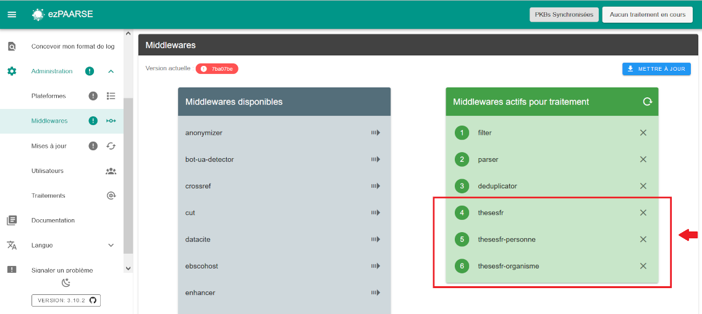
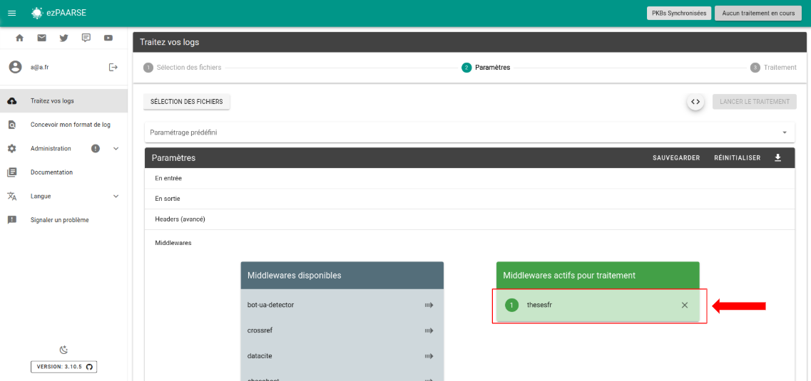

# thesesfr

Fetches thesesfr API from ABES.
This middleware is used only for log from theses.fr.  

## Enriched fields

| Name | Type   | Description |
| --- |--------| --- |
| rtype | String | type of consultation (ABS = thesis notice viewed; PDF_THESIS = thesis file downloaded) |
| nnt | String | National Thesis Number |
| numSujet | String | thesis identifier in the STEP database |
| etabSoutenanceN | String | name of the thesis defense institution |
| etabSoutenancePpn | String | identifier (PPN) of the thesis defense institution |
| codeCourt | String | short code of the thesis defense institution |
| dateSoutenance | String | thesis defense date |
| anneeSoutenance | String | thesis defense year |
| dateInscription | String | doctoral registration date |
| anneeInscription | String | doctoral registration year |
| statut | String | thesis status: "soutenue" (defended) or "enCours" (in preparation) |
| discipline | String | thesis discipline |
| ecoleDoctoraleN | String | name of the doctoral school associated with the thesis |
| ecoleDoctoralePpn | String | identifier (PPN) of the doctoral school associated with the thesis |
| partenaireRechercheN | String | name of the research partner (laboratory, company, research team, foundation, etc.) |
| partenaireRecherchePpn | String | identifier (PPN) of the research partner (laboratory, company, research team, foundation, etc.) |
| auteurN | String | name of the thesis author |
| auteurPpn | String | identifier (PPN) of the thesis author |
| directeurN | String | name of the thesis supervisor |
| directeurPpn | String | identifier (PPN) of the thesis supervisor |
| presidentN | String | name of the jury president |
| presidentPpn | String | identifier (PPN) of the jury president |
| rapporteursN | String | names of the reviewers |
| rapporteursPpn | String | identifier (PPN) of the reviewers |
| membresN | String | names of the jury members |
| membresPpn | String | identifier (PPN) of the jury members |
| personneN | String | "sans objet" (irrelevant) |
| personnePpn | String | "sans objet" (irrelevant) |
| organismeN | String | "sans objet" (irrelevant) |
| organismePpn | String | "sans objet" (irrelevant) |
| idp_etab_nom | String | name of the user's affiliated institution (when connecting via Renater) |
| idp_etab_ppn | String | identifier (PPN) of the user's affiliated institution (when connecting via Renater) |
| idp_etab_code_court | String | short code of the user's affiliated institution (when connecting via Renater) |
| platform_name | String | full name of the resource hosting platform: theses.fr |
| publication_title | String | title of the resource |
| source | String | Upcoming : data source: STEP, STAR, Sudoc |
| domaine | String | Upcoming : thematic domain associated with the thesis |
| doiThese | String | Upcoming : DOI assigned to the thesis |
| accessible | String | Upcoming : is the thesis accessible online: yes or no |
| langue | String | Upcoming : language of the thesis writing | 

## Prerequisites

Ec needs unitid and rtype equal to PHD_THESIS or ABS.

**You must use thesesfr after filter, parser, deduplicator middleware.**  

**You must use the 3 middlewares at once, in this order : thesesfr, thesesfr-personne, thesesfr-organisme**  
``` -H "ezPAARSE-Middlewares: thesesfr,thesesfr-personne,thesesfr-organisme" ```

## Headers

+ **thesesfr-ttl** : Lifetime of cached documents, in seconds. Defaults to ``7 days (3600 * 24 * 7)``.
+ **thesesfr-throttle** : Minimum time to wait between queries, in milliseconds. Defaults to ``200``ms.
+ **thesesfr-base-wait-time** : Time to wait before retrying after a query fails, in milliseconds. Defaults to ``1000``ms. This time ``doubles`` after each attempt.
+ **thesesfr-paquet-size** : Maximum number of identifiers to send for query in a single request. Defaults to ``50``.
+ **thesesfr-buffer-size** : Maximum number of memorized access events before sending a request. Defaults to ``1000``.
+ **thesesfr-max-attempts** : Maximum number of trials before passing the EC in error. Defaults to ``5``.
+ **thesesfr-user-agent** : Specify what to send in the `User-Agent` header when querying thesesfr. Defaults to `ezPAARSE (https://readmetrics.org; mailto:ezteam@couperin.org)`.

## How to use

### ezPAARSE admin interface

You can add or remove thesesfr by default to all your enrichments, provided you have added an API key in the config. To do this, go to the middleware section of administration.



### ezPAARSE process interface

You can use thesesfr for an enrichment process. You just add the middleware



### ezp

You can use thesesfr for an enrichment process with [ezp](https://github.com/ezpaarse-project/node-ezpaarse) like this:

```bash
# enrich with one file
ezp process <path of your file> \
  --host <host of your ezPAARSE instance> \
  --settings <settings-id> \
  --header "ezPAARSE-Filter-Redirects: false" \
  --header "ezPAARSE-Middlewares: thesesfr,thesesfr-personne,thesesfr-organisme"
  --header "Output-Fields: +nnt, +numSujet, +etabSoutenanceN, +etabSoutenancePpn, +codeCourt, +dateSoutenance, +anneeSoutenance, +dateInscription, +anneeInscription, +statut, +discipline, +ecoleDoctoraleN, +ecoleDoctoralePpn, +partenaireRechercheN, +partenaireRecherchePpn, +auteurN, +auteurPpn, +directeurN, +directeurPpn, +presidentN, +presidentPpn, +rapporteursN, +rapporteursPpn, +membresN, +membresPpn, +personneN, +personnePpn, +organismeN, +organismePpn, +platform_name, +publication_title, +libelle_idp"
  --header "Log-Format-apache: %h %l %{login}<.*> %t \"%r\" %>s %b \"%{Referer}<.*>\" \"%{User-Agent}<.*>\" \"%{Shib-Identity-Provider}<.*>\" \"%{eppn}<.*>\" \"%{primary-affiliation}<.*>\" \"%{supannEtablissement}<.*>\""
  --out ./result.csv


# enrich with multiples files
ezp bulk <path of your directory> \
  --host <host of your ezPAARSE instance> \
  --settings <settings-id> 
  --header "ezPAARSE-Filter-Redirects: false" \
  --header "ezPAARSE-Middlewares: thesesfr,thesesfr-personne,thesesfr-organisme" 
  --header "Output-Fields: +nnt, +numSujet, +etabSoutenanceN, +etabSoutenancePpn, +codeCourt, +dateSoutenance, +anneeSoutenance, +dateInscription, +anneeInscription, +statut, +discipline, +ecoleDoctoraleN, +ecoleDoctoralePpn, +partenaireRechercheN, +partenaireRecherchePpn, +auteurN, +auteurPpn, +directeurN, +directeurPpn, +presidentN, +presidentPpn, +rapporteursN, +rapporteursPpn, +membresN, +membresPpn, +personneN, +personnePpn, +organismeN, +organismePpn, +platform_name, +publication_title, +libelle_idp"
  --header "Log-Format-apache: %h %l %{login}<.*> %t \"%r\" %>s %b \"%{Referer}<.*>\" \"%{User-Agent}<.*>\" \"%{Shib-Identity-Provider}<.*>\" \"%{eppn}<.*>\" \"%{primary-affiliation}<.*>\" \"%{supannEtablissement}<.*>\""
```

### curl

You can use thesesfr for an enrichment process with curl like this:

```bash
curl -X POST -v http://localhost:59599 \
  -H "ezPAARSE-Filter-Redirects: false" \
  -H "ezPAARSE-Middlewares: thesesfr,thesesfr-personne,thesesfr-organisme,idp-metadata" \
  -H "Output-Fields: +nnt, +numSujet, +etabSoutenanceN, +etabSoutenancePpn, +codeCourt, +dateSoutenance, +anneeSoutenance, +dateInscription, +anneeInscription, +statut, +discipline, +ecoleDoctoraleN, +ecoleDoctoralePpn, +partenaireRechercheN, +partenaireRecherchePpn, +auteurN, +auteurPpn, +directeurN, +directeurPpn, +presidentN, +presidentPpn, +rapporteursN, +rapporteursPpn, +membresN, +membresPpn, +personneN, +personnePpn, +organismeN, +organismePpn, +platform_name, +publication_title, +libelle_idp" \
  -H "Log-Format-apache: %h %l %{login}<.*> %t \"%r\" %>s %b \"%{Referer}<.*>\" \"%{User-Agent}<.*>\" \"%{Shib-Identity-Provider}<.*>\" \"%{eppn}<.*>\" \"%{primary-affiliation}<.*>\" \"%{supannEtablissement}<.*>\""
-F "file=@<log file path>"

```
