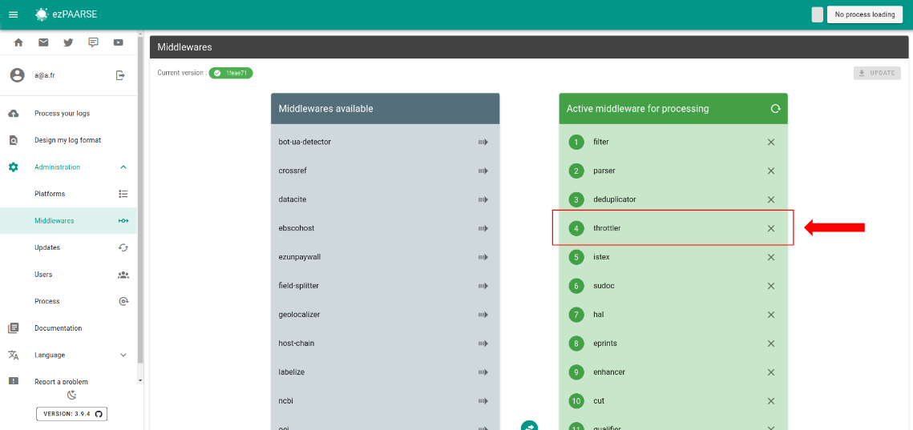
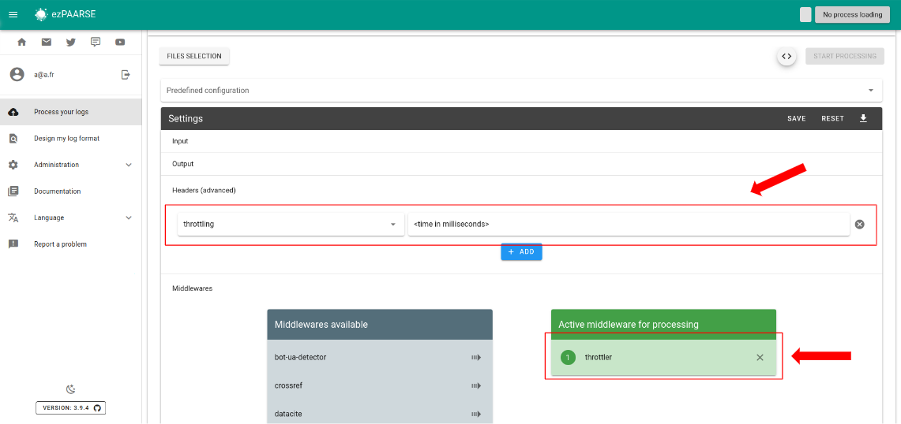

# throttler

Regulates the consultation events' stream by artificially adding time between each treatment

## Headers

+ **Throttling** : Minimum time to wait between queries in milliseconds. Defaults to ``0``ms.

## How to use

### ezPAARSE config

You can add or remove your throttler on ezpaarse config. It will be used on every process that used throttler middleware. You need to add this code on your `config.local.json`.

```json
{
  "EZPAARSE_DEFAULT_HEADERS": {
    "Throttling": "<time to wait between queries in milliseconds>"
  }
}
```

### ezPAARSE admin interface

You can add or remove throttler by default to all your enrichments. To do this, go to the middleware section of administration.



### ezPAARSE process interface

You can use throttler for an enrichment process.



### ezp

You can use throttler for an enrichment process with [ezp](https://github.com/ezpaarse-project/node-ezpaarse) like this:

```bash
# enrich with one file
ezp process <path of your file> \
  --host <host of your ezPAARSE instance> \
  --settings <settings-id> \
  --header "ezPAARSE-Middlewares: throttler" \
  --header "throttler: <time in miniseconds>" \
  --out ./result.csv

# enrich with multiples files
ezp bulk <path of your directory> \
  --host <host of your ezPAARSE instance> \
  --settings <settings-id> \
  --header "ezPAARSE-Middlewares: throttler" \
  --header "throttler: <time in miniseconds>"

```

### curl

You can use throttler for an enrichment process with curl like this:

```bash
curl -X POST -v http://localhost:59599 \
  -H "ezPAARSE-Middlewares: throttler" \
  -H "throttler: <time in miniseconds>" \
  -H "Log-Format-Ezproxy: <line format>" \
  -F "file=@<log file path>"

```