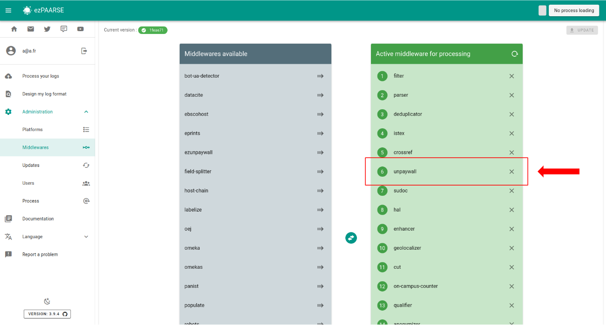
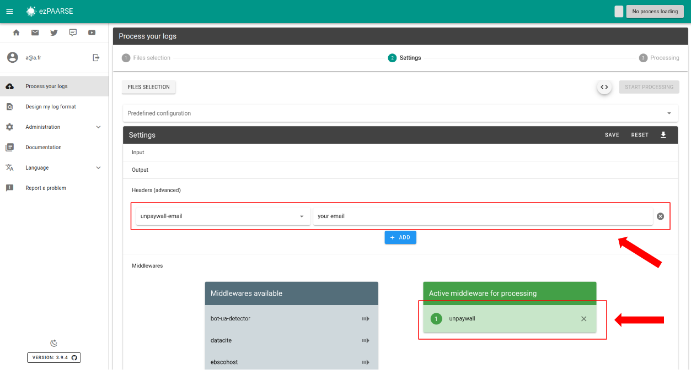

# unpaywall

Fetches [unpaywall](https://www.unpaywall.org/) metadata

## Enriched fields

| Name | Type | Description |
| --- | --- | --- |
| publication_title | String | Name of publication. |
| is_oa | Boolean | Is there an OA copy of this resource. |
| journal_is_in_doaj | Boolean | Is this resource published in a DOAJ-indexed journal. |
| journal_is_oa | Boolean | Is this resource published in a completely OA journal. |
| oa_status | String | The OA status, or color, of this resource. |
| updated | String | Time when the data for this resource was last updated. |
| oa_request_date | Date | Date of open access information. |

## Prerequisites

Your EC needs a DOI for enrichment.
This API is limited to **100 000** DOIs per day for everyone. It is necessary to indicate an email address when querying unpaywall.
**Open access information is valid for EC generated on the same day**. Unpaywall data does not retain open access history.

**You must use unpaywall after filter, parser, deduplicator middleware.**

## Headers

+ **unpaywall-cache** : Set to ``false`` to disable result caching. Enabled by default.
+ **unpaywall-TTL** : Lifetime of cached documents, in seconds. Defaults to ``7 days (3600 * 24 * 7)``
+ **unpaywall-throttle** : Minimum time to wait between each query, in milliseconds. Defaults to ``100``ms. Throttle time ``doubles`` after each failed attempt.
+ **unpaywall-paquet-size** : Maximum number of DOIs to request in parallel. Defaults to ``10``
+ **unpaywall-buffer-size** : Maximum number of memorized access events before sending requests. Defaults to ``200``
+ **unpaywall-max-tries** : Maximum number of attempts if an enrichment fails. Defaults to ``5``.
+ **unpaywall-on-fail** : Strategy to adopt if an enrichment reaches the maximum number of attempts. Can be either of ``abort``, ``ignore`` or ``retry``. Defaults to ``abort``.
+ **unpaywall-email** : The email to use for API calls. Defaults to ``YOUR_EMAIL``.
+ **unpaywall-max-attempts** : Maximum number of trials before passing the EC in error. Defaults to ``5``.

## How to use

### ezPAARSE admin interface

You can add unpaywall by default to all your enrichments, To do this, go to the middleware section of administration.



### ezPAARSE process interface

You can use unpaywall for an enrichment process. You just add the middleware.



### ezp

You can use unpaywall for an enrichment process with [ezp](https://github.com/ezpaarse-project/node-ezpaarse) like this:

```bash
# enrich with one file
ezp process <path of your file> \
  --host <host of your ezPAARSE instance> \
  --settings <settings-id> \
  --header "ezPAARSE-Middlewares: unpaywall" \
  --header "unpaywall-email: <your email>" \
  --out ./result.csv

# enrich with multiples files
ezp bulk <path of your directory> \
  --host <host of your ezPAARSE instance> \
  --settings <settings-id> \
  --header "unpaywall-email: <your email>" \
  --header "ezPAARSE-Middlewares: unpaywall" 

```

### curl

You can use unpaywall for an enrichment process with curl like this:

```bash
curl -X POST -v http://localhost:59599 \
  -H "ezPAARSE-Middlewares: unpaywall" \
  -H "unpaywall-email: <your email>" \
  -H "Log-Format-Ezproxy: <line format>" \
  -F "file=@<log file path>"

```