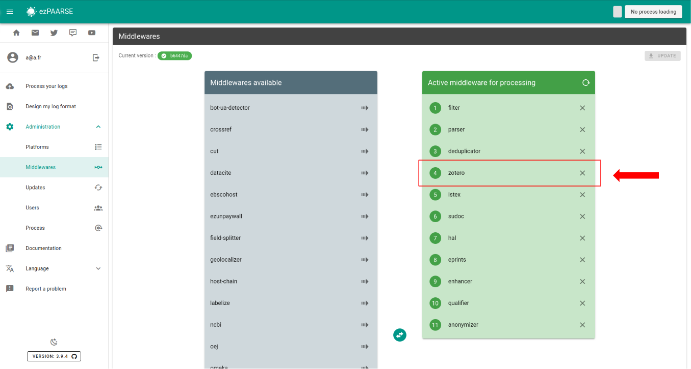
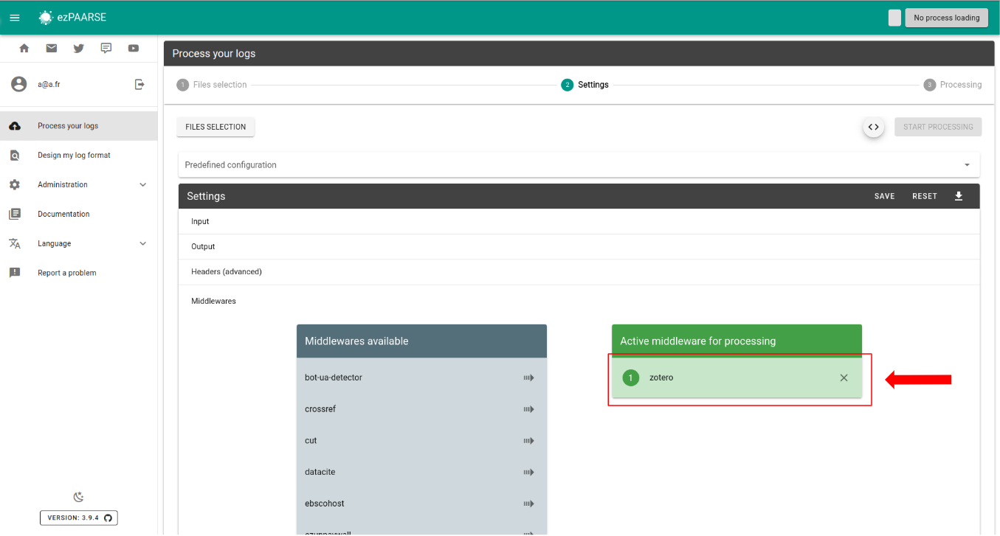

# zotero

Enriches consultation events with [zotero]

## Enriched fields

| Name | Type | Description |
| --- | --- | --- |
| zotero_doi | String | DOI of publication. |
| zotero_issn | String | Print identifier of publication. |
| zotero_title | String | Title of pulication. |

## Headers

+ **zotero-enrich** : Set to ``false`` to disable zotero enrichment. Enabled by default.
+ **zotero-cache** : Enable/Disable cache.
+ **zotero-license** : Set to ``true`` to get the ``license`` field as JSON. Disabled by default.
+ **zotero-ttl** : Lifetime of cached documents, in seconds. Defaults to ``7 days (3600 * 24 * 7)``.
+ **zotero-throttle** : Minimum time to wait between queries, in milliseconds. Defaults to ``200``ms.
+ **zotero-paquet-size** : Maximum number of identifiers to send for query in a single request. Defaults to ``50``.
+ **zotero-buffer-size** : Maximum number of memorised access events before sending a request. Defaults to ``1000``.

## Prerequisites

**You must use zotero after filter, parser, deduplicator middleware.**

## How to use

### ezPAARSE admin interface

You can add or remove zotero by default to all your enrichments. To do this, go to the middleware section of administration.



### ezPAARSE process interface

You can use zotero for an enrichment process.



### ezp

You can use zotero for an enrichment process with [ezp](https://github.com/ezpaarse-project/node-ezpaarse) like this:

```bash
# enrich with one file
ezp process <path of your file> \
  --host <host of your ezPAARSE instance> \
  --settings <settings-id> \
  --header "ezPAARSE-Middlewares: zotero" \
  --out ./result.csv

# enrich with multiples files
ezp bulk <path of your directory> \
  --host <host of your ezPAARSE instance> \
  --settings <settings-id> \
  --header "ezPAARSE-Middlewares: zotero" 

```

### curl

You can use zotero for an enrichment process with curl like this:

```bash
curl -X POST -v http://localhost:59599 \
  -H "ezPAARSE-Middlewares: zotero" \
  -H "Log-Format-Ezproxy: <line format>" \
  -F "file=@<log file path>"

```

